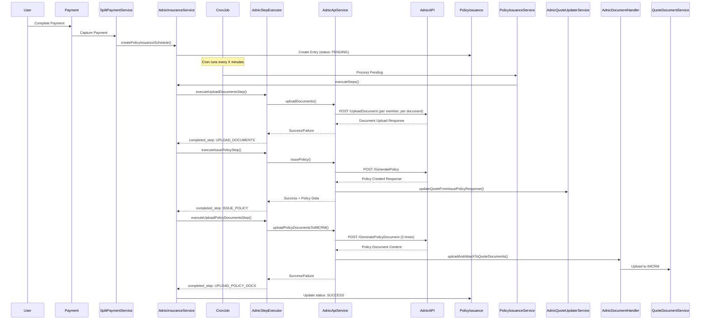

# ADNIC Health Policy Issuance Automation Documentation

## Overview

The ADNIC Health Policy Issuance Automation Module is a comprehensive automated system that integrates with ADNIC Insurance API to streamline health insurance policy issuance for **STP (Straight Through Processing) cases only**. It automatically handles document uploads, policy generation, and document retrieval without manual intervention, significantly reducing processing time and human error.

**Important**: The automation only triggers for STP cases where `$quote->isSTPCase()` returns true. Non-STP cases require manual processing.

## Table of Contents

1. [Architecture Overview](#architecture-overview)
2. [Core Components](#core-components)
3. [Workflow & Step Execution](#workflow--step-execution)
4. [API Integration](#api-integration)
5. [Document Handling](#document-handling)
6. [Configuration & Environment](#configuration--environment)
7. [Error Handling & Logging](#error-handling--logging)
8. [Testing Strategy](#testing-strategy)
9. [Development Guidelines](#development-guidelines)

---

## Architecture Overview

The ADNIC Policy Issuance Automation follows a modular architecture pattern with step-based execution:

```
┌─────────────────────────────────────────┐
│         Trigger Layer                   │
│   (Payment Capture → Schedule Creation) │
└─────────────────┬───────────────────────┘
                  │
┌─────────────────┴───────────────────────┐
│      Orchestration Layer                │
│    (AdnicInsuranceService)              │
│   - Step Sequence Management            │
│   - Resume from Last Completed Step     │
│   - Status Tracking                     │
└─────────────────┬───────────────────────┘
                  │
┌─────────────────┴───────────────────────┐
│       Execution Layer                   │
│     (AdnicStepExecutor)                 │
│   - Execute Individual Steps            │
│   - Update Quote Status                 │
└─────────────────┬───────────────────────┘
                  │
┌─────────────────┴───────────────────────┐
│         API Communication Layer         │
│      (AdnicApiService)                  │
│   - Issue Policy                        │
│   - Upload Documents                    │
│   - Download Policy Documents           │
└─────────────────┬───────────────────────┘
                  │
┌─────────────────┴───────────────────────┐
│      Supporting Services                │
│  - AdnicRequestBuilder (Payloads)       │
│  - AdnicResponseHandler (Parsing)       │
│  - AdnicDocumentHandler (Documents)     │
│  - AdnicValidationService (Validation)  │
│  - AdnicQuoteUpdaterService (Updates)   │
└─────────────────┬───────────────────────┘
                  │
┌─────────────────┴───────────────────────┐
│        HTTP Layer                       │
│     (AdnicHttpClient)                   │
│   - Base URL Configuration              │
│   - Authentication Headers              │
│   - Timeout Management                  │
└─────────────────┬───────────────────────┘
                  │
┌─────────────────┴───────────────────────┐
│       External System                   │
│       (ADNIC Insurance API)             │
└─────────────────────────────────────────┘
```

**Related**: On **`policy_issuance.status` → TIMEOUT** (ADNIC), `PolicyIssuanceObserver` schedules **`PolicyIssuanceTimeoutRetryJob`** (see [Timeout status and automated retry](#timeout-status-and-automated-retry)).

---

## Core Components

### 1. AdnicInsuranceService (Orchestrator)

**Location**: `app/Services/PolicyIssuanceAutomation/Health/Adnic/AdnicInsuranceService.php`

**Implements**: `PolicyIssuanceInterface`

**Responsibilities**:

- Entry point for policy issuance automation
- Manages step execution sequence
- Handles automation enable/disable checks
- Creates policy issuance schedules
- Resumes from last completed step on failures
- Provides UI locking status for manual intervention

**Key Methods**:

```php
// Check if automation is enabled
public function isPolicyIssuanceAutomationEnabled(): bool

// Timeout retry: read cooldown (minutes) and max retries from Application Storage
public function getPolicyIssuanceTimeoutRetryCooldownMinutes(): int
public function getAllowRetryForTimeout(): int

// When policy issuance moves to TIMEOUT, schedule PolicyIssuanceTimeoutRetryJob (observer-driven)
public function handleTimeoutStatusUpdate(PolicyIssuance $policyIssuance): void

// Map the *next* step after completed_step to an insurer API failure status (stuck/failed flows)
public function getInsurerAPIStatusByStep($policyIssuance): ?int

// Manual retry: failed/timeout at document upload with no completed step → reset to PENDING
public function retryPolicyIssuance($policyIssuance)

// Create automation schedule on payment capture (STP cases only)
public function createPolicyIssuanceSchedule($quote, $insurer): void

// Execute automation steps sequentially; may set `timeout` => true when ADNIC returns
// "The Policy Conversion is already in Progress" (AdnicEnum::POLICY_CONVERSION_ALREADY_IN_PROGRESS)
public function executeSteps($process): array

// Get next step to execute
public function getNextStep($completedStep = null): ?string

// Get UI locking status for manual operations
public function getStepsLockingStatus($quote, $throughAutomation = false): array
```

**Important**: The `createPolicyIssuanceSchedule()` method checks `$quote->isSTPCase()` before creating the schedule. Only STP (Straight Through Processing) cases are eligible for automation.

**Step Handlers Mapping**:

```php
private array $stepHandlers = [
    AdnicEnum::STEP_ISSUE_POLICY => 'executeIssuePolicyStep',
    AdnicEnum::STEP_UPLOAD_DOCUMENTS => 'executeUploadDocumentsStep',
    AdnicEnum::STEP_UPLOAD_POLICY_DOCS => 'executeUploadPolicyDocumentsStep',
];
```

**Step Execution Order**:

1. `STEP_UPLOAD_DOCUMENTS` - Upload customer documents to ADNIC
2. `STEP_ISSUE_POLICY` - Create policy with ADNIC
3. `STEP_UPLOAD_POLICY_DOCS` - Download policy documents from ADNIC and upload to IMCRM

---

### 2. AdnicStepExecutor (Execution Engine)

**Location**: `app/Services/PolicyIssuanceAutomation/Health/Adnic/AdnicStepExecutor.php`

**Responsibilities**:

- Executes individual automation steps
- Updates quote status on success/failure
- Delegates API calls to AdnicApiService
- Handles step-specific error scenarios

**Key Methods**:

```php
// Execute document upload step
public function executeUploadDocumentsStep($quote, $process): array

// Execute policy issuance step
public function executeIssuePolicyStep($quote, $process): array

// Execute policy document upload step
public function executeUploadPolicyDocumentsStep($quote, $process): array
```

**Error Handling**:

- Each step returns a standardized response array
- Updates `policy_issuance` table with API status codes
- Logs failures with detailed context for debugging

---

### 3. AdnicApiService (API Communication)

**Location**: `app/Services/PolicyIssuanceAutomation/Health/Adnic/AdnicApiService.php`

**Responsibilities**:

- Direct interaction with ADNIC Insurance API
- Orchestrates API calls with proper payloads
- Stores API logs for audit trails
- Updates quote and payment data after successful API calls

**Key Methods**:

```php
// Issue policy with ADNIC
public function issuePolicy($quote, $process, $healthInsurerRequestResponse): array

// Upload customer documents to ADNIC
public function uploadDocuments($quote, $process, $healthInsurerRequestResponse): array

// Download policy documents from ADNIC and upload to IMCRM
public function uploadPolicyDocumentsToIMCRM($quote, $process): array
```

**API Endpoints Used**:

- `/GeneratePolicy` - Create policy
- `/UploadDocument` - Upload customer documents
- `/GeneratePolicyDocument` - Download policy documents

---

### 4. AdnicHttpClient (HTTP Layer)

**Location**: `app/Services/PolicyIssuanceAutomation/Health/Adnic/AdnicHttpClient.php`

**Responsibilities**:

- Manages HTTP communication with ADNIC API
- Configures authentication, headers, and timeouts
- Provides consistent error handling for HTTP errors
- Centralizes API configuration

**Configuration**:

```php
// From config/constants.php (backed by .env)
'ADNIC_API_BASE_URL' => env('ADNIC_API_BASE_URL')   // Host/base only — see URL construction below
'ADNIC_PARTNER_ID' => env('ADNIC_PARTNER_ID')
'ADNIC_PARTNER_REFERENCE_NO' => env('ADNIC_PARTNER_REFERENCE_NO')
'ADNIC_AUTHORIZATION_TOKEN' => env('ADNIC_AUTHORIZATION_TOKEN')
'ADNIC_SUBSCRIPTION_KEY' => env('ADNIC_SUBSCRIPTION_KEY')

// From ApplicationStorage
ADNIC_HEALTH_AUTOMATION_API_TIMEOUT
```

**Effective API base URL** (built in the client constructor):

`{ADNIC_API_BASE_URL}` + `/MedicalProductAPI/MedicalAPI.svc/API/Medical`

Example: if `ADNIC_API_BASE_URL=https://api.adnic.ae/dev`, requests go to  
`https://api.adnic.ae/dev/MedicalProductAPI/MedicalAPI.svc/API/Medical{endpoint}`.

**HTTP resilience**: `post()` uses Laravel’s HTTP client with **up to 5 retries** on connection failures (including timeouts). Retry sleep is 10 seconds between attempts in normal runs (1 ms in unit tests). Failed HTTP status codes (4xx/5xx) are **not** retried; callers inspect the `Response` object.

**Headers**:

```php
[
    'Content-Type' => 'application/json',
    'Accept' => 'application/json',
    'Ocp-Apim-Subscription-Key' => $subscriptionKey,
    'Authorization' => $authToken,
]
```

---

### 5. AdnicRequestBuilder (Payload Builder)

**Location**: `app/Services/PolicyIssuanceAutomation/Health/Adnic/AdnicRequestBuilder.php`

**Responsibilities**:

- Constructs API request payloads from domain models
- Formats dates, addresses, and other data as per API requirements
- Builds headers for specific API calls
- Maps IMCRM data to ADNIC API format

**Key Methods**:

```php
// Build payload for policy issuance
public function buildIssuePolicyPayload($quote, $process, $healthInsurerRequestResponse, $splitPayment): array

// Build payload for document upload
public function buildUploadDocumentsPayload(string $base64Content, $healthInsurerResponse, $insuredMember, $insurerDocCode, $quoteDocument): array

// Build payload for document download
public function buildDownloadDocumentPayload($generatePolicyResponse, $docId): array
```

**Data Mappings**:

- Salary Band: `1 => 1 (4000 and less)`, `2 => 2 (More than 4000)`
- Gender: IMCRM format → `M` or `F`
- Marital Status: `1 => Single`, `2 => Married`, `3 => Widowed`, `4 => Divorced`
- Nationality: Full mapping from country names to ADNIC codes
- Relation: `self => S`, `spouse => SP`, `child => C`, `parent => P`

---

### 6. AdnicResponseHandler (Response Parser)

**Location**: `app/Services/PolicyIssuanceAutomation/Health/Adnic/AdnicResponseHandler.php`

**Responsibilities**:

- Normalizes HTTP responses into consistent structure
- Extracts error messages from various response formats
- Handles success/failure states
- Builds standardized step response arrays

**Key Methods**:

```php
// Parse HTTP response from ADNIC
public function parseHttpResponse(Response $response, string $apiKey): array

// Build standardized step response
public function buildStepResponse(string $step, bool $status = false, ?string $message = null, $error = null, $data = null): array
```

**Response Structure**:

```php
[
    'status' => true|false,
    'error' => string|null,
    'message' => string|null,
    'data' => mixed|null,
    'completed_step' => string|null,
]
```

**Error Detection**:

- Checks for `ErrorInfo` array in response
- Checks for `DocumentInfo->ErrorInfo` array
- Handles null responses
- Handles HTTP 404 responses
- Extracts error messages from nested structures

---

### 7. AdnicDocumentHandler (Document Management)

**Location**: `app/Services/PolicyIssuanceAutomation/Health/Adnic/AdnicDocumentHandler.php`

**Responsibilities**:

- Fetches document content from Azure storage
- Maps document types between IMCRM and ADNIC
- Validates document MIME types
- Uploads downloaded policy documents to IMCRM

**Allowed MIME Types**:

```php
['application/pdf', 'image/jpeg', 'image/png']
```

**Document Type Mappings**:

**IMCRM → ADNIC (Upload)** — `AdnicDocumentHandler::getInsurerDocCodeForHealth()` / `getQuoteDocumentTypeCodessToUpload()`:

| IMCRM / flow                            | ADNIC document type code | Notes                            |
| --------------------------------------- | ------------------------ | -------------------------------- |
| `HEA_EMIRATE_ID_COPY` (aggregated slot) | `3`                      | Emirates ID (single or combined) |
| `HEA_INSURED_EMIRATES_ID_APPLICATION`   | `2`                      | Insured Emirates ID Application  |
| `HEA_EID_FRONT`                         | `4`                      | Emirates ID front                |
| `HEA_EID_BACK`                          | `5`                      | Emirates ID back                 |
| `HEA_VISA`                              | `6`                      | Visa                             |
| `HEA_PAS`                               | `1`                      | Passport                         |
| `HEA_BIRTH_CERTIFICATE`                 | `11`                     | Birth Certificate                |
| `HEA_MEDICAL_APPLICATION_FORM`          | `18`                     | Medical Application Form         |
| `HEA_CUSTOMER_DUE_DILIGENCE`            | `17`                     | Customer Due Diligence           |

**ADNIC → IMCRM (Download)**:

- `PolicyDocumentId` → `POLC` (Policy Schedule)
- `CommisionNoteDocumentId` → `TIRBB` (Commission Note)
- `TaxInvoiceDocumentId` → `TI` (Tax Invoice)

**Key Methods**:

```php
// Fetch document content from Azure
public function fetchDocumentContent(string $relativePath): array

// Get documents by type codes
public function getDocumentByType($quote, array $documentTypeCodes)

// Upload document to IMCRM
public function uploadAndAttachToQuoteDocuments($quote, $documentContent, $documentCode, $originalName = null)

// Get insurer document code for health documents
public function getInsurerDocCodeForHealth(string $documentType): ?string
```

**Important Note**:

- `fetchDocumentContent()` returns RAW content (not base64)
- Base64 encoding is done in `AdnicApiService::uploadDocuments()`
- `uploadAndAttachToQuoteDocuments()` expects base64 encoded content
- Always sets `is_base_64 = 1` flag for proper handling

---

### 8. AdnicValidationService (Validation Logic)

**Location**: `app/Services/PolicyIssuanceAutomation/Health/Adnic/AdnicValidationService.php`

**Responsibilities**:

- Validates required data before automation starts
- Validates documents before upload
- Validates document availability before download
- Provides detailed error messages for missing data

**Key Methods**:

```php
// Validate all required data for policy issuance
public function validateRequiredData($quote): array

// Validate documents before upload
public function validateUploadDocuments($quote, $quoteDocuments, $insuredInfoDetails): array

// Validate document IDs before download
public function validateDownloadDocuments($quote, $docTypeCodeForIMCRM): array
```

**Required Data** (`validateRequiredData`):

- Health UMAF Response
- Payments
- Insurer Quote Number (from `insurerGenerateQuoteRequestResponse`)
- Customer

**Upload step** (`validateUploadDocuments`): all of the following document type codes must be present on the quote at least once:  
`HEA_MEDICAL_APPLICATION_FORM`, `HEA_CUSTOMER_DUE_DILIGENCE`, `HEA_EMIRATE_ID_COPY`, `HEA_PAS`, `HEA_VISA`, `HEA_BIRTH_CERTIFICATE`.

---

### 9. AdnicQuoteUpdaterService (Quote Updates)

**Location**: `app/Services/PolicyIssuanceAutomation/Health/Adnic/AdnicQuoteUpdaterService.php`

**Responsibilities**:

- Updates quote with policy issuance response data
- Updates quote status to PolicyIssued
- Filters out null values to avoid overwriting existing data

**Key Methods**:

```php
// Update quote from policy issuance response
public function updateQuoteFromIssuePolicyResponse($quote, $issuePolicyResult): void

// Update payment from policy issuance response (commented out currently)
public function updatePaymentFromIssuePolicyResponse(string $quoteCode, $issuePolicyResult): void
```

**Updated Fields**:

- `policy_number`
- `policy_start_date`
- `policy_expiry_date`
- `quote_status_id` → `QuoteStatusEnum::PolicyIssued`
- `policy_issuance_status_id` → `PolicyIssuanceStatusEnum::PolicyIssued`
- `quote_status_date`

---

### 10. AdnicBookPolicyService (UI Locking Logic)

**Location**: `app/Services/PolicyIssuanceAutomation/Health/Adnic/AdnicBookPolicyService.php`

**Responsibilities**:

- Determines which steps are editable in the UI
- Provides locking status based on automation progress
- Allows manual intervention when automation fails

**Key Method**:

```php
// Get steps locking status for UI
public function getStepsLockingStatus($quote, $throughAutomation = false): array
```

**Locking Logic** (when `throughAutomation` is false, the UI uses this for **failed** automation or **incomplete step with empty status**; see `AdnicBookPolicyService` for exact conditions):

| Scenario                                          | `isEditPolicyDetailsDisabled` | Message (summary)                                          |
| ------------------------------------------------- | ----------------------------- | ---------------------------------------------------------- |
| Through automation (`throughAutomation === true`) | No (editable)                 | All steps editable                                         |
| No `policyIssuance` record                        | No                            | All steps editable                                         |
| Failed, no `completed_step`                       | No                            | All steps editable                                         |
| Failed after `UploadDocuments`                    | No                            | Issue Policy and Update Booking Details are editable       |
| Failed after `IssuePolicy`                        | No                            | Policy document retrieval and Booking Details are editable |
| Failed after `UploadPolicyDocumentsToIMCRM`       | No                            | Booking Details is editable                                |
| Other statuses (e.g. success in progress)         | Yes (locked)                  | All steps are locked (default)                             |

The response also includes `policyIssuance`, `insurer_api_status`, and a human-readable `message`.

---

### 11. AdnicHttpFacade (Facade Pattern)

**Location**: `app/Facades/AdnicHttpFacade.php`

**Responsibilities**:

- Provides static access to AdnicHttpClient
- Simplifies dependency injection
- Enables easy mocking in tests

**Usage**:

```php
use App\Facades\AdnicHttpFacade;

$response = AdnicHttpFacade::post($endpoint, $payload);
$baseUrl = AdnicHttpFacade::getBaseUrl();
```

---

### 12. AdnicServiceProvider (Dependency Injection)

**Location**: `app/Providers/AdnicServiceProvider.php`

**Responsibilities**:

- Registers AdnicHttpClient as singleton
- Binds AdnicInsuranceService with dependencies
- Ensures proper dependency injection

**Registered in**: `config/app.php` providers array

---

## Workflow & Step Execution

### Complete Automation Flow



### Step 1: Upload Documents

**Purpose**: Upload required customer documents to ADNIC for each insured member

**Process**:

1. Retrieve insured members from `healthInsurerRequestResponse`
2. Required document categories are validated in `AdnicValidationService::validateUploadDocuments()` (must exist on the quote): Medical Application Form, Customer Due Diligence, Emirates ID (`HEA_EMIRATE_ID_COPY` flow), Passport, Visa, Birth Certificate — see [Document type mappings](#document-type-mappings) for insurer codes.
3. **Emirates ID handling**: UMAF answer `typeOfEID` drives whether documents are treated as physical Emirates ID (front/back split → ADNIC types `4`/`5`), a single Emirates ID upload (`3`), or Emirates ID Application (`2`). See `AdnicDocumentHandler::modifyEmirateDocument()` and `getDocumentByType()`.
4. For each member:
   - For each required document:
     - Fetch document content from Azure storage (RAW format)
     - Validate MIME type (PDF, JPEG, PNG only)
     - Encode to base64
     - Build upload payload with member and document info
     - POST to `/UploadDocument` endpoint
     - Store API log
5. Update `completed_step` to `STEP_UPLOAD_DOCUMENTS`

**Validation**:

- Documents must exist in quote
- Insured info details must be available
- Document content must be fetchable
- MIME type must be allowed

**Failure Scenarios**:

- Document not found in Azure
- Invalid MIME type
- API call failure
- Missing insured info

**API Payload Example**:

```json
{
  "PartnerInfo": {
    "PartnerId": "PARTNER_ID"
  },
  "DocumentInfo": {
    "QuotationNo": "QUOTE123",
    "MemberSeqNo": 1,
    "DocumentType": "3",
    "DocumentName": "Emirates_ID.pdf",
    "DocumentUploadDate": "2024-01-15T10:30:00Z",
    "IsDocumentValidated": "Y",
    "DocumentContent": "base64_encoded_content..."
  }
}
```

---

### Step 2: Issue Policy

**Purpose**: Create the policy with ADNIC using quote and payment information

**Process**:

1. Retrieve payment and split payment (credit card)
2. Retrieve health UMAF response answers
3. Build insured info array from `healthInsurerRequestResponse`
4. Get uploaded document info from previous step logs
5. Build comprehensive policy payload
6. POST to `/GeneratePolicy` endpoint
7. Parse response and extract policy info
8. Update quote with policy details
9. Store API log
10. Update `completed_step` to `STEP_ISSUE_POLICY`

**Validation**:

- Health UMAF Response exists
- Payments exist
- Insurer Quote Number exists
- Customer exists

**Failure Scenarios**:

- Payment information missing
- API validation errors
- Policy creation failure
- Missing required fields

**API Payload Structure**:

```json
{
  "PartnerInfo": {
    "PartnerId": "PARTNER_ID"
  },
  "SponsorInfo": {
    "SponserType": "Individual",
    "SponserName": "John Doe",
    "MobileNo": "+971505636254",
    "EmailId": "email@example.com",
    ...
  },
  "QuoteInfo": {
    "PartnerReferenceNo": "REF123",
    "PartnerPremium": 1000,
    "QuotationNo": "QUOTE123",
    "VisaEmirate": 1,
    "ProductType": "SHIFA",
    "PolicyType": "F",
    "PlanType": "GO",
    ...
  },
  "InsuredInfo": [
    {
      "MemberSeqNo": 1,
      "Salutation": "Mr",
      "MemberName": "John Doe",
      "DateOfBirth": "01-01-1990",
      "Gender": "M",
      "Relation": "S",
      ...
      "DocumentInfo": {
        "1": [
          {"DocumentType": "3", "DocumentId": "DOC123"},
          {"DocumentType": "6", "DocumentId": "DOC456"}
        ]
      }
    }
  ],
  "PolicyInfo": {
    "PolicyStartDate": "01-02-2024",
    "PaymentType": 5,
    "PaymentRefNo": "ch_123456"
  }
}
```

**Response Data Extracted**:

- `PolicyInfo.PolicyNo` → `policy_number`
- `PolicyInfo.PolicyStartDate` → `policy_start_date`
- `PolicyInfo.PolicyEndDate` → `policy_expiry_date`
- `PolicyDocumentInfo.PolicyDocumentId`
- `PolicyDocumentInfo.CommisionNoteDocumentId`
- `PolicyDocumentInfo.TaxInvoiceDocumentId`

---

### Step 3: Upload Policy Documents to IMCRM

**Purpose**: Download policy documents from ADNIC and upload them to IMCRM

**Process**:

1. Retrieve policy issuance response from logs
2. Extract document IDs (Policy, Commission Note, Tax Invoice)
3. Validate document type codes for IMCRM exist
4. For each document ID:
   - Build download payload
   - POST to `/GeneratePolicyDocument` endpoint
   - Receive base64 encoded document content
   - Map ADNIC document type to IMCRM document type
   - Upload to IMCRM via `QuoteDocumentService`
   - Mark as uploaded
5. Verify all 3 documents uploaded successfully
6. Update `completed_step` to `STEP_UPLOAD_POLICY_DOCS`

**Required Documents**:

- Policy Document (`PolicyDocumentId` → `POLC`)
- Commission Note (`CommisionNoteDocumentId` → `TIRBB`)
- Tax Invoice (`TaxInvoiceDocumentId` → `TI`)

**Failure Scenarios**:

- Document download failure
- Missing document IDs
- Upload to IMCRM failure
- Incomplete document set (< 3 documents)

**API Payload Example**:

```json
{
  "PartnerInfo": {
    "PartnerId": "PARTNER_ID"
  },
  "PolicyDocumentInfo": {
    "PartnerReferenceNo": "REF123",
    "QuotationNo": "QUOTE123",
    "PolicyNo": "POL123",
    "DocumentId": "DOC_ID_123"
  }
}
```

**Response Data**:

```json
{
  "DocumentInfo": {
    "documentContent": "base64_encoded_pdf...",
    "documentName": "Policy_POL123.pdf"
  }
}
```

---

### Resume from Failure

**Feature**: Automation can resume from the last completed step after a failure or timeout

**Process**:

1. Cron job picks up failed/timeout policy issuances
2. `AdnicInsuranceService` checks `completed_step`
3. Calls `getNextStep()` to determine where to resume
4. Executes remaining steps only
5. Skips already completed steps

**Example**:

```php
// Last completed step was UPLOAD_DOCUMENTS
$lastCompletedStep = 'UploadDocuments';
$nextStep = $service->getNextStep($lastCompletedStep);
// Returns: 'IssuePolicy'

// Automation will execute:
// 1. IssuePolicy
// 2. UploadPolicyDocumentsToIMCRM
// 3. (Skip UploadDocuments - already done)
```

---

### Timeout status and automated retry

When a policy issuance record for ADNIC is updated to **`TIMEOUT`**, `PolicyIssuanceObserver` calls `AdnicInsuranceService::handleTimeoutStatusUpdate()` (only when the provider is ADNIC and the dirty field is `status`).

If `ENABLE_RETRY_TIMEOUT_ADNIC_HEALTH_POLICY_ISSUANCE` is enabled:

1. **`PolicyIssuanceTimeoutRetryJob`** is dispatched to the **`policy-issuance-automation`** queue after **`ADNIC_POLICY_ISSUANCE_TIMEOUT_RETRY_COOLDOWN_MINUTES`** (minimum 0).
2. The job implements **`ShouldBeUnique`** (unique id per `policy_issuance_id`, lock ~600 seconds) to avoid stacking duplicate retries.
3. On run, the job verifies the row is still `TIMEOUT`, compares **`retry_count`** to **`ADNIC_NUMBER_OF_ALLOWED_RETRY_FOR_TIMEOUT`**, and if under the limit updates the row to **`PENDING`** and increments **`retry_count`** so the cron-driven automation can run again.

If retry automation is disabled, max retries are reached, or the status is no longer `TIMEOUT`, the job exits without changing the record.

### “Policy conversion already in progress” (soft timeout signal)

If a step returns a message containing **`The Policy Conversion is already in Progress`** (`AdnicEnum::POLICY_CONVERSION_ALREADY_IN_PROGRESS`), `executeSteps()` adds **`'timeout' => true`** to the response so upstream logic can treat it similarly to a timeout scenario where appropriate.

---

## API Integration

### Authentication

**Method**: Header-based authentication

**Headers**:

```php
'Authorization' => 'Bearer {TOKEN}' or 'Token {TOKEN}'
'Ocp-Apim-Subscription-Key' => '{SUBSCRIPTION_KEY}'
'Content-Type' => 'application/json'
'Accept' => 'application/json'
```

**Configuration**:

```env
# Base URL only (Medical API path is appended in AdnicHttpClient — see Core Components → AdnicHttpClient)
ADNIC_API_BASE_URL=https://api.adnic.ae/dev
ADNIC_AUTHORIZATION_TOKEN=your_token_here
ADNIC_SUBSCRIPTION_KEY=your_subscription_key_here
ADNIC_PARTNER_ID=your_partner_id
ADNIC_PARTNER_REFERENCE_NO=your_reference_no
```

---

### API Endpoints

#### 1. Upload Document

**Endpoint**: `/UploadDocument`  
**Method**: `POST`  
**Purpose**: Upload customer documents for policy members

**Success Response**:

```json
{
  "DocumentInfo": {
    "DocumentId": "DOC123",
    "DocumentType": "3",
    "QuotationNo": "QUOTE123",
    "MemberSeqNo": 1
  }
}
```

**Error Response**:

```json
{
  "ErrorInfo": [
    {
      "ErrorCode": "E001",
      "ErrorMsg": "Invalid document type"
    }
  ]
}
```

---

#### 2. Generate Policy

**Endpoint**: `/GeneratePolicy`  
**Method**: `POST`  
**Purpose**: Create health insurance policy

**Success Response**:

```json
{
  "data": {
    "QuoteInfo": {
      "QuotationNo": "QUOTE123",
      "PartnerReferenceNo": "REF123"
    },
    "PolicyInfo": {
      "PolicyNo": "POL123456",
      "PolicyStartDate": "01-02-2024",
      "PolicyEndDate": "31-01-2025",
      "PolicyIssuedDate": "15-01-2024"
    },
    "PolicyDocumentInfo": {
      "PolicyDocumentId": "POLDOC123",
      "CommisionNoteDocumentId": "COMDOC123",
      "TaxInvoiceDocumentId": "TAXDOC123"
    }
  }
}
```

---

#### 3. Generate Policy Document

**Endpoint**: `/GeneratePolicyDocument`  
**Method**: `POST`  
**Purpose**: Download policy documents (PDF)

**Success Response**:

```json
{
  "DocumentInfo": {
    "documentContent": "JVBERi0xLjQKJeLjz9MK...",
    "documentName": "Policy_POL123.pdf",
    "documentType": "Policy"
  }
}
```

---

### Error Handling

**HTTP Status Codes**:

- `200 OK` - Success, but check response body for API errors
- `404 Not Found` - Endpoint not found
- `500 Internal Server Error` - Server error
- `Timeout` - Request timeout (configurable)

**API-Level Errors**:

```php
// Error detection logic in AdnicResponseHandler
if ($responseObject == null) {
    return error;
}

if (isset($responseObject->ErrorInfo) && count($responseObject->ErrorInfo) > 0) {
    return error with ErrorInfo[0]->ErrorMsg;
}

if (isset($responseObject->DocumentInfo->ErrorInfo) && count($responseObject->DocumentInfo->ErrorInfo) > 0) {
    return error with DocumentInfo->ErrorInfo[0]->ErrorMsg;
}
```

---

## Document Handling

### Document Flow

```
┌────────────────────────────────────┐
│  IMCRM Quote Documents             │
│  (Azure Storage)                   │
└────────────┬───────────────────────┘
             │ Fetch RAW content
             ▼
┌────────────────────────────────────┐
│  AdnicDocumentHandler              │
│  - fetchDocumentContent()          │
│  - Validate MIME type              │
└────────────┬───────────────────────┘
             │ Return RAW content
             ▼
┌────────────────────────────────────┐
│  AdnicApiService                   │
│  - base64_encode()                 │
│  - Build upload payload            │
└────────────┬───────────────────────┘
             │ POST with base64
             ▼
┌────────────────────────────────────┐
│  ADNIC API                         │
│  - Store documents                 │
│  - Link to quote/member            │
└────────────────────────────────────┘
```

### Document Download Flow

```
┌────────────────────────────────────┐
│  ADNIC API                         │
│  - GET policy documents            │
└────────────┬───────────────────────┘
             │ Return base64 content
             ▼
┌────────────────────────────────────┐
│  AdnicApiService                   │
│  - Receive base64 content          │
│  - Map document types              │
└────────────┬───────────────────────┘
             │ Pass base64 content
             ▼
┌────────────────────────────────────┐
│  AdnicDocumentHandler              │
│  - uploadAndAttachToQuoteDocuments()│
│  - Set is_base_64 = 1 flag         │
└────────────┬───────────────────────┘
             │ Upload with base64 flag
             ▼
┌────────────────────────────────────┐
│  QuoteDocumentService              │
│  - Decode base64                   │
│  - Upload to Azure                 │
│  - Create quote_documents record   │
└────────────────────────────────────┘
```

### MIME Type Validation

**Allowed Types**:

```php
const ALLOWED_DOCUMENT_MIME_TYPES = [
    'application/pdf',
    'image/jpeg',
    'image/png'
];
```

**Detection Method**:

```php
$finfo = finfo_open(FILEINFO_MIME_TYPE);
$mimeType = finfo_buffer($finfo, $fileContent);
finfo_close($finfo);
```

---

## Configuration & Environment

### Application Storage Settings

These settings are managed via `ApplicationStorage` table and can be toggled without code deployment:

| Key                                                    | Purpose                                                     | Type    |
| ------------------------------------------------------ | ----------------------------------------------------------- | ------- |
| `ENABLE_ADNIC_HEALTH_POLICY_ISSUANCE`                  | Master switch for automation                                | boolean |
| `ENABLE_RETRY_TIMEOUT_ADNIC_HEALTH_POLICY_ISSUANCE`    | Enable delayed retry when status becomes TIMEOUT            | boolean |
| `ADNIC_POLICY_ISSUANCE_TIMEOUT_RETRY_COOLDOWN_MINUTES` | Minutes to wait before `PolicyIssuanceTimeoutRetryJob` runs | integer |
| `ADNIC_NUMBER_OF_ALLOWED_RETRY_FOR_TIMEOUT`            | Max times a timeout can be reset to PENDING via the job     | integer |
| `ADNIC_HEALTH_AUTOMATION_API_TIMEOUT`                  | API timeout in seconds                                      | integer |

**Access Method**:

```php
use App\Services\ApplicationStorageService;

$enabled = app(ApplicationStorageService::class)
    ->getValueByKey(ApplicationStorageEnums::ENABLE_ADNIC_HEALTH_POLICY_ISSUANCE);
```

---

### Environment Variables

**Required in `.env`**:

```env
# ADNIC API Configuration (base host/path prefix only; Medical API path is appended in AdnicHttpClient)
ADNIC_API_BASE_URL=https://api.adnic.ae/dev
ADNIC_AUTHORIZATION_TOKEN=Bearer_or_Token_here
ADNIC_SUBSCRIPTION_KEY=subscription_key_here
ADNIC_PARTNER_ID=partner_id_here
ADNIC_PARTNER_REFERENCE_NO=reference_number_here

# Azure Storage (for documents)
AZURE_IM_STORAGE_URL=https://yourstorage.blob.core.windows.net
AZURE_IM_STORAGE_CONTAINER=your_container_name
```

---

### Constants Configuration

**Location**: `config/constants.php`

---

## Test Factories

### Factory Locations

All test factories are located in `database/factories/` directory:

**Health Quote Factories**:

- `HealthQuoteFactory.php` - Creates health quotes with STP/non-STP states
- `HealthInsurerRequestResponseFactory.php` - Creates insurer API responses
- `QuoteDocumentFactory.php` - Creates documents (EID, Visa, Passport)

**Customer & Related Factories**:

- `CustomerFactory.php` - Creates customers with Emirates ID
- `NationalityFactory.php` - Creates nationalities

**Provider & Payment Factories**:

- `InsuranceProviderFactory.php` - Creates insurance providers (ADNIC state)
- `PaymentFactory.php` - Creates payments with lead payment state
- `PaymentSplitFactory.php` - Creates payment splits (authorised/captured)
- `PaymentChargeFactory.php` - Creates payment charges

**Policy Issuance Factories**:

- `PolicyIssuanceFactory.php` - Creates policy issuance records (pending/processing/timeout)

### Factory States

**HealthQuoteFactory States**:

```php
HealthQuote::factory()->withSTPCase()->create();      // STP eligible
HealthQuote::factory()->withNonSTPCase()->create();   // Non-STP
```

**InsuranceProviderFactory States**:

```php
InsuranceProvider::factory()->adnic()->create();  // ADNIC provider
```

**QuoteDocumentFactory States**:

```php
QuoteDocument::factory()->emiratesId()->create(['quote_documentable_id' => $quote->id]);
QuoteDocument::factory()->visa()->create(['quote_documentable_id' => $quote->id]);
QuoteDocument::factory()->passport()->create(['quote_documentable_id' => $quote->id]);
```

**PaymentSplitFactory States**:

```php
PaymentSplit::factory()->authorised()->create();  // Authorised status
PaymentSplit::factory()->captured()->create();    // Captured status
```

**PolicyIssuanceFactory States**:

```php
PolicyIssuance::factory()->pending()->create();     // Pending status
PolicyIssuance::factory()->processing()->create();  // Processing status
PolicyIssuance::factory()->timeout()->create();     // Timeout status
```

### Factory Relationships

**Creating Complete Health Quote Flow**:

```php
// Create quote with all relationships
$quote = HealthQuote::factory()
    ->withSTPCase()
    ->for(Customer::factory())
    ->for(Nationality::factory())
    ->create();

// Create payment chain
$payment = Payment::factory()->leadPayment()->create([
    'code' => $quote->code,
    'quote_id' => $quote->id,
]);

$paymentSplit = PaymentSplit::factory()->authorised()->create([
    'payment_id' => $payment->id,
]);

PaymentCharge::factory()->create([
    'payment_splits_id' => $paymentSplit->id,
]);

// Create documents
QuoteDocument::factory()->emiratesId()->create(['quote_documentable_id' => $quote->id]);
QuoteDocument::factory()->visa()->create(['quote_documentable_id' => $quote->id]);
QuoteDocument::factory()->passport()->create(['quote_documentable_id' => $quote->id]);

// Create policy issuance
PolicyIssuance::factory()->pending()->create([
    'model_id' => $quote->id,
]);
```

---

## Test Database Configuration

```php
return [
    // ADNIC API — base URL only; AdnicHttpClient appends /MedicalProductAPI/MedicalAPI.svc/API/Medical
    'ADNIC_API_BASE_URL' => env('ADNIC_API_BASE_URL', ''),
    'ADNIC_PARTNER_ID' => env('ADNIC_PARTNER_ID', ''),
    'ADNIC_PARTNER_REFERENCE_NO' => env('ADNIC_PARTNER_REFERENCE_NO', ''),
    'ADNIC_AUTHORIZATION_TOKEN' => env('ADNIC_AUTHORIZATION_TOKEN', ''),
    'ADNIC_SUBSCRIPTION_KEY' => env('ADNIC_SUBSCRIPTION_KEY', ''),

    // Azure Storage
    'AZURE_IM_STORAGE_URL' => env('AZURE_IM_STORAGE_URL', ''),
    'AZURE_IM_STORAGE_CONTAINER' => env('AZURE_IM_STORAGE_CONTAINER', ''),
];
```

---

### Enum Configuration

**Location**: `app/Enums/AdnicEnum.php`

Representative constants (not exhaustive — see source for the full list):

```php
class AdnicEnum
{
    // Responsible person `EmailId` / `MobileNo` in AdnicRequestBuilder use the health quote email and mobile (not enum defaults).

    // Steps (automation sequence uses the first three; STEP_BOOK_POLICY reserved for UI/booking flows)
    public const STEP_ISSUE_POLICY = 'IssuePolicy';
    public const STEP_UPLOAD_DOCUMENTS = 'UploadDocuments';
    public const STEP_UPLOAD_POLICY_DOCS = 'UploadPolicyDocumentsToIMCRM';
    public const STEP_BOOK_POLICY = 'BookPolicy';

    // Response keys
    public const RESPONSE_POLICY = 'PolicyResponse';
    public const RESPONSE_UPLOAD_DOCUMENTS = 'UploadDocumentsResponse';
    public const RESPONSE_DOWNLOAD_DOCUMENT = 'DownloadDocumentResponse';

    // Insurer document keys (issue-policy response)
    public const INSURER_DOCUMENT_KEY_POLICY_DOCUMENT = 'PolicyDocumentId';
    public const INSURER_DOCUMENT_KEY_COMMISION_NOTE = 'CommisionNoteDocumentId';
    public const INSURER_DOCUMENT_KEY_TAX_INVOICE = 'TaxInvoiceDocumentId';

    // Emirates ID / UMAF (typeOfEID)
    public const EMIRATES_ID_TEXT = 'Emirates ID';
    public const EMIRATES_ID_CODE = 3;
    public const INSURED_EMIRATES_ID_APPLICATION_TEXT = 'EID Application Form';
    public const INSURED_EMIRATES_ID_APPLICATION_CODE = 2;

    // Policy payload / member defaults (see AdnicRequestBuilder)
    public const DEFAULT_EMIRATE_OF_YOUR_VISA = 2;
    public const CUSTOMER_CLASSIFICATION_NATURAL_PERSONS = 1;
    public const VISA_TYPE_EXISTING_VISA_HOLDER = 2;
    public const NATIONALITY_ID_EMIRATES_ID = 146;
    public const OCCUPATION_OTHER = 13;
    public const SPONSER_CATEGORY_UAE = 2;
    public const MEMBER_CATEGORY_DUBAI_RESIDENCY = 4;
    public const DUBAI_RESIDENCY = 110;

    // Policy Payload Defaults
    public const LOADING_TYPE = 'PER';
    public const LOADING_VALUE = 0;
    public const LOADING_AMOUNT = 0;
    public const PAYMENT_TYPE = 5;
    public const NO = 'NO';

    // Soft timeout / concurrency message from ADNIC
    public const POLICY_CONVERSION_ALREADY_IN_PROGRESS = 'The Policy Conversion is already in Progress';
}
```

---

## Error Handling & Logging

### Logging Strategy

The system uses `LoggerService` with feature-specific logging:

```php
use App\Services\Logger\LoggerService;
use App\Enums\Logger\LoggerFeatureEnum;

// Start quote logging context
LoggerService::startQuoteLogging($quote, LoggerFeatureEnum::ADNIC_HEALTH_POLICY_AUTOMATION);

// Log information
LoggerService::info('Policy issuance started', extra: [
    'process_id' => $process->id,
    'step' => AdnicEnum::STEP_ISSUE_POLICY,
]);

// Log errors
LoggerService::error('API call failed', extra: [
    'endpoint' => $endPoint,
    'error' => $error,
], exception: $exception);
```

### Log Categories

**Information Logs**:

- Automation initiation
- Step execution start/completion
- API call initiation/completion
- Validation success

**Warning Logs**:

- Automation disabled
- Invalid step encountered
- Resume from last completed step

**Error Logs**:

- Validation failures
- API call failures
- Document fetch failures
- Step execution failures
- HTTP errors
- Exceptions

### API Logs Storage

All API calls are stored in `policy_issuance_logs` table:

```php
app(PolicyIssuanceService::class)->storePolicyIssuanceLog(
    $quote,
    $payload,        // Request payload
    $response,       // Response data
    $endpoint,       // Full API URL
    $step,           // Step name
    $status,         // SUCCESS_STATUS or FAILED_STATUS
    $process         // PolicyIssuance model
);
```

**Table Structure**:

- `policy_issuance_id` - Links to policy_issuance table
- `model_type` - HealthQuote class
- `model_id` - Quote ID
- `step` - Step name
- `endPoint` - API endpoint
- `payload` - JSON request
- `response` - JSON response
- `status` - SUCCESS or FAILED
- `created_at` - Timestamp

**Usage**:

- Debugging API failures
- Audit trail
- Resume from last successful step
- Monitoring API performance

---

### Error Response Format

**Standardized Error Response**:

```php
[
    'status' => false,
    'error' => 'Detailed error message',
    'message' => 'User-friendly message',
    'completed_step' => 'last_completed_step',
    'data' => null,
]
```

**Common Error Scenarios**:

1. **Validation Errors**:

```php
[
    'status' => false,
    'error' => 'Missing required data: payments, customer',
    'message' => 'Missing required data: payments, customer',
]
```

2. **API Errors**:

```php
[
    'status' => false,
    'error' => 'PolicyResponse API Failed',
    'message' => 'Invalid member details provided',
]
```

3. **Document Errors**:

```php
[
    'status' => false,
    'error' => 'Invalid or empty document content',
    'message' => 'Invalid or empty document content',
]
```

---

### Exception Handling

**Try-Catch Pattern**:

```php
try {
    // Validation
    $validationResult = $this->validationService->validateRequiredData($quote);
    if (!$validationResult['status']) {
        return $validationResult;
    }

    // Step execution
    $result = $this->executeStepSequence($quote, $process, $nextStep);

    return $result;
} catch (Exception $e) {
    LoggerService::error('Exception occurred', extra: [
        'process_id' => $process->id,
        'quote_id' => $quote->id,
    ], exception: $e);

    return [
        'status' => false,
        'error' => $e->getMessage(),
        'message' => null,
    ];
}
```

---

## Testing Strategy

### Test Structure

The testing suite is organized into two main categories and uses **Pest PHP testing framework**:

**Unit Tests** (`tests/Unit/Services/Adnic/`):

- `AdnicApiServiceTest.php` - Policy issue, upload, and download flows
- `AdnicBookPolicyServiceTest.php` - UI locking messages and failure states
- `AdnicDocumentHandlerTest.php` - Document handling and type mappings
- `AdnicHttpClientTest.php` - Base URL construction, headers, retries, POST behavior
- `AdnicInsuranceServiceTest.php` - Orchestration, steps, `getInsurerAPIStatusByStep`, timeouts
- `AdnicQuoteUpdaterServiceTest.php` - Quote updates from issue-policy response
- `AdnicRequestBuilderTest.php` - Payload construction
- `AdnicResponseHandlerTest.php` - API response parsing
- `AdnicStepExecutorTest.php` - Step execution logic
- `AdnicValidationServiceTest.php` - Required data and mandatory documents

**Jobs** (`tests/Unit/Jobs/`):

- `PolicyIssuanceTimeoutRetryJobTest.php` - Timeout → PENDING retry, `retry_count`, max retries, cooldown dispatch

**Note**: Tests use **Pest** syntax. There is no separate `AdnicPolicyIssuanceIntegrationTest` feature file; coverage is through the unit tests above and shared test schema (`tests/Support/Schema`).

---

### Unit Tests Coverage

#### 1. AdnicValidationServiceTest (Pest)

**Test Coverage**:

- ✓ Validates required data passes with all data present
- ✓ Fails when payments missing
- ✓ Fails when customer missing
- ✓ Fails when health UMAF response missing
- ✓ Fails when insurer quote number missing
- ✓ Validates upload documents with valid data
- ✓ Fails when documents missing
- ✓ Fails when insured info missing
- ✓ Validates download documents with all required documents
- ✓ Fails when document IDs are missing
- ✓ Validation returns consistent error/success structure

**Run Command**:

```bash
doppler run -- php artisan test tests/Unit/Services/Adnic/AdnicValidationServiceTest.php
```

**Sample Pest Test**:

```php
test('validate required data passes with all data present', function () {
    $customer = Mockery::mock(Customer::class);
    $payment = Mockery::mock(Payment::class);
    // ... setup mocks

    $result = $this->service->validateRequiredData($quote);

    expect($result['status'])->toBeTrue();
});
```

---

#### 2. AdnicResponseHandlerTest (Pest)

**Test Coverage**:

- ✓ Builds step response with correct structure
- ✓ Builds step response with default values
- ✓ Parses successful HTTP response
- ✓ Handles API error with error list
- ✓ Handles null response object
- ✓ Handles 404 Not Found
- ✓ Handles generic HTTP errors
- ✓ Handles error info array from ADNIC API
- ✓ Handles document info error array
- ✓ Returns consistent structure for all responses

**Run Command**:

```bash
doppler run -- php artisan test tests/Unit/Services/Adnic/AdnicResponseHandlerTest.php
```

**Sample Pest Test**:

```php
test('parse http response handles successful response', function () {
    $responseData = (object) ['policyInfo' => (object) ['policyNo' => 'POL123']];
    $responseMock = Mockery::mock(Response::class);
    $responseMock->shouldReceive('successful')->once()->andReturn(true);
    $responseMock->shouldReceive('object')->once()->andReturn($responseData);

    $result = $this->handler->parseHttpResponse($responseMock, 'TestAPI');

    expect($result['status'])->toBeTrue()
        ->and($result['error'])->toBeNull()
        ->and($result['data'])->toBe($responseData);
});
```

---

#### 3. AdnicStepExecutorTest (Pest)

**Test Coverage**:

- ✓ Executes upload documents step successfully
- ✓ Handles upload documents step failure
- ✓ Executes issue policy step successfully
- ✓ Handles issue policy step failure
- ✓ Executes upload policy documents step successfully
- ✓ Handles upload policy documents step failure
- ✓ All step methods return standardized response structure

**Run Command**:

```bash
doppler run -- php artisan test tests/Unit/Services/Adnic/AdnicStepExecutorTest.php
```

**Sample Pest Test**:

```php
test('execute upload documents step succeeds', function () {
    $quote = Mockery::mock(HealthQuote::class);
    $process = Mockery::mock(PolicyIssuance::class);

    $this->apiServiceMock->shouldReceive('uploadDocuments')
        ->once()
        ->andReturn([
            'status' => true,
            'completed_step' => AdnicEnum::STEP_UPLOAD_DOCUMENTS,
            'message' => 'Documents uploaded successfully',
        ]);

    $result = $this->executor->executeUploadDocumentsStep($quote, $process);

    expect($result['status'])->toBeTrue()
        ->and($result['completed_step'])->toBe(AdnicEnum::STEP_UPLOAD_DOCUMENTS);
});
```

---

#### 4. AdnicInsuranceServiceTest (Pest)

**Test Coverage**:

- ✓ Checks if automation is enabled
- ✓ Checks if retry for timeout is enabled
- ✓ Returns first step when no completed step
- ✓ Returns correct step sequence
- ✓ Returns null when all steps completed
- ✓ Returns null for invalid step
- ✓ Returns error when automation disabled
- ✓ Returns error when validation fails
- ✓ Successfully completes all steps
- ✓ Stops execution on step failure
- ✓ Creates policy issuance schedule when enabled and STP
- ✓ Does not create schedule when disabled
- ✓ Does not create schedule when not STP case
- ✓ Delegates locking status to book policy service
- ✓ Handles exceptions gracefully
- ✓ Resumes from last completed step

**Run Command**:

```bash
doppler run -- php artisan test tests/Unit/Services/Adnic/AdnicInsuranceServiceTest.php
```

**Sample Pest Test**:

```php
test('execute steps successfully completes all steps', function () {
    $quote = Mockery::mock(HealthQuote::class);
    $process = Mockery::mock(PolicyIssuance::class);

    $this->validationServiceMock->shouldReceive('validateRequiredData')
        ->once()
        ->andReturn(['status' => true]);

    // Mock all three steps to succeed
    $this->stepExecutorMock->shouldReceive('executeUploadDocumentsStep')->once()->andReturn([...]);
    $this->stepExecutorMock->shouldReceive('executeIssuePolicyStep')->once()->andReturn([...]);
    $this->stepExecutorMock->shouldReceive('executeUploadPolicyDocumentsStep')->once()->andReturn([...]);

    $result = $this->service->executeSteps($process);

    expect($result['status'])->toBeTrue()
        ->and($result['message'])->toContain('completed successfully');
});
```

---

#### 5. AdnicDocumentHandlerTest (Pest)

**Test Coverage**:

- ✓ Returns correct insurer doc codes for health documents
- ✓ Returns null for invalid document types
- ✓ Returns correct IMCRM document type mappings
- ✓ Returns exactly three document mappings
- ✓ Returns correct quote document type codes to upload
- ✓ Has correct structure for upload document types
- ✓ Returns matching documents by type
- ✓ Returns null when no documents found
- ✓ Filters documents by type codes
- ✓ Builds correct data array for IMCRM upload
- ✓ Always sets is_base_64 flag to 1
- ✓ Returns error for empty file path
- ✓ Returns error for non-existent file
- ✓ Verifies raw content return (not base64)
- ✓ Document type mappings are consistent
- ✓ All health document types are supported

**Run Command**:

```bash
doppler run -- php artisan test tests/Unit/Services/Adnic/AdnicDocumentHandlerTest.php
```

**Sample Pest Test**:

```php
test('get insurer doc code for health returns correct codes', function () {
    expect($this->handler->getInsurerDocCodeForHealth(DocumentTypeCode::HEA_EMIRATE_ID_COPY))->toBe('3')
        ->and($this->handler->getInsurerDocCodeForHealth(DocumentTypeCode::HEA_VISA))->toBe('6')
        ->and($this->handler->getInsurerDocCodeForHealth(DocumentTypeCode::HEA_PAS))->toBe('1');
});
```

---

### Running All Tests

**Run all Adnic tests (Pest + SQLite)**:

```bash
doppler run -- php artisan test --filter=Adnic
```

**Run with coverage**:

```bash
doppler run -- php artisan test --filter=Adnic --coverage
```

**Run specific test file**:

```bash
doppler run -- php artisan test tests/Unit/Services/Adnic/AdnicInsuranceServiceTest.php
```

**Run tests with parallel execution** (Pest feature):

```bash
doppler run -- php artisan test --parallel --filter=Adnic
```

**Run specific test**:

```bash
doppler run -- php artisan test --filter="creates health quote with all relationships"
```

**Test Performance** (with SQLite):

- Unit tests: ~0.5-1 second per test file
- Feature tests: ~1-2 seconds per test file
- Total suite: ~5-10 seconds (97+ Adnic-related tests; one may be skipped depending on environment)
- Parallel: ~2-3 seconds total

---

### Test Data Setup

**Database Configuration**:

- Tests use **SQLite** in-memory database (`:memory:`) for fast, isolated testing
- Configured in `phpunit.xml`: `DB_CONNECTION=sqlite` and `DB_DATABASE=:memory:`
- Each test gets a fresh database via `RefreshDatabase` trait
- No MySQL/external database required for running tests

**Factory Usage**:
All ADNIC tests use Laravel factories to create realistic test data:

| Factory                                   | Purpose                   | Key States                               |
| ----------------------------------------- | ------------------------- | ---------------------------------------- |
| `HealthQuote::factory()`                  | Health insurance quotes   | `withSTPCase()`, `withNonSTPCase()`      |
| `Customer::factory()`                     | Customer with emirates ID | -                                        |
| `InsuranceProvider::factory()`            | Insurance providers       | `adnic()`                                |
| `Nationality::factory()`                  | Nationalities             | -                                        |
| `Payment::factory()`                      | Payment records           | `leadPayment()`                          |
| `PaymentSplit::factory()`                 | Payment splits            | `authorised()`, `captured()`             |
| `PaymentCharge::factory()`                | Payment charges           | -                                        |
| `QuoteDocument::factory()`                | Health documents          | `emiratesId()`, `visa()`, `passport()`   |
| `PolicyIssuance::factory()`               | Policy issuance records   | `pending()`, `processing()`, `timeout()` |
| `HealthInsurerRequestResponse::factory()` | Insurer API responses     | -                                        |

**Factory Example Usage**:

```php
use Illuminate\Foundation\Testing\RefreshDatabase;

uses(RefreshDatabase::class);

test('creates health quote with all relationships', function () {
    $quote = HealthQuote::factory()
        ->withSTPCase()
        ->for(Customer::factory())
        ->for(Nationality::factory())
        ->create();

    // Create documents
    QuoteDocument::factory()->emiratesId()->create(['quote_documentable_id' => $quote->id]);
    QuoteDocument::factory()->visa()->create(['quote_documentable_id' => $quote->id]);
    QuoteDocument::factory()->passport()->create(['quote_documentable_id' => $quote->id]);

    // Create payment
    $payment = Payment::factory()->leadPayment()->create([
        'code' => $quote->code,
        'quote_id' => $quote->id,
    ]);

    expect($quote->customer)->not->toBeNull()
        ->and($quote->documents)->toHaveCount(3);
});
```

**Mock ApplicationStorage (Pest)**:

```php
function mockApplicationStorage(bool $enabled): void
{
    $mockService = Mockery::mock(ApplicationStorageService::class);
    $mockService->method('getValueByKey')
        ->willReturnMap([
            [ApplicationStorageEnums::ENABLE_ADNIC_HEALTH_POLICY_ISSUANCE, $enabled],
            [ApplicationStorageEnums::ENABLE_RETRY_TIMEOUT_ADNIC_HEALTH_POLICY_ISSUANCE, $enabled],
        ]);

    app()->instance(ApplicationStorageService::class, $mockService);
}
```

When testing **`handleTimeoutStatusUpdate`**, **`PolicyIssuanceTimeoutRetryJob`**, or **`getPolicyIssuanceTimeoutRetryCooldownMinutes` / `getAllowRetryForTimeout`**, also map `ApplicationStorageEnums::ADNIC_POLICY_ISSUANCE_TIMEOUT_RETRY_COOLDOWN_MINUTES` and `ADNIC_NUMBER_OF_ALLOWED_RETRY_FOR_TIMEOUT` (and keep `ADNIC_HEALTH_AUTOMATION_API_TIMEOUT` for HTTP client tests).

**Helper Functions (Pest)**:

```php
uses(RefreshDatabase::class); // SQLite database reset per test

beforeEach(function () {
    mockApplicationStorage(true);
    createTestData(); // Uses factories, not mocks
});

function createTestData(): void
{
    // Create insurer using factory
    $insurer = InsuranceProvider::factory()->adnic()->create();

    // Create complete quote with relationships
    $quote = HealthQuote::factory()
        ->withSTPCase()
        ->for(Customer::factory())
        ->for(Nationality::factory())
        ->create();

    // Create payment chain
    $payment = Payment::factory()->create([
        'code' => $quote->code,
        'quote_id' => $quote->id,
    ]);

    // Create documents
    QuoteDocument::factory()->emiratesId()->create(['quote_documentable_id' => $quote->id]);
    QuoteDocument::factory()->visa()->create(['quote_documentable_id' => $quote->id]);
    QuoteDocument::factory()->passport()->create(['quote_documentable_id' => $quote->id]);
}
```

**Benefits of Factory + SQLite Approach**:

- ✅ **Fast** - SQLite in-memory is 10-100x faster than MySQL
- ✅ **Isolated** - Each test gets fresh database, no test pollution
- ✅ **Realistic** - Factories create valid model relationships
- ✅ **Maintainable** - Factories centralize test data logic
- ✅ **No Setup** - No external database required, works anywhere
- ✅ **CI/CD Ready** - Perfect for automated testing pipelines

---

## Development Guidelines

### Code Style & Standards

**Follow Laravel 12 Standards**:

- Use `declare(strict_types=1);` in all files
- Apply strict typing to all method parameters and return types
- Use PHP 8.2+ features (readonly properties, match expressions)
- Follow PSR-12 coding standards

**Example**:

```php
<?php

declare(strict_types=1);

namespace App\Services\PolicyIssuanceAutomation\Health\Adnic;

class AdnicApiService
{
    public function __construct(
        private AdnicRequestBuilder $requestBuilder,
        private AdnicResponseHandler $responseHandler,
    ) {}

    public function issuePolicy($quote, $process, $healthInsurerRequestResponse): array
    {
        // Implementation
    }
}
```

---

### Adding a New Step

To add a new automation step:

**1. Define Step Constant** in `AdnicEnum`:

```php
public const STEP_MY_NEW_STEP = 'MyNewStep';
```

**2. Add Step Handler** in `AdnicInsuranceService`:

```php
private array $stepHandlers = [
    AdnicEnum::STEP_UPLOAD_DOCUMENTS => 'executeUploadDocumentsStep',
    AdnicEnum::STEP_ISSUE_POLICY => 'executeIssuePolicyStep',
    AdnicEnum::STEP_UPLOAD_POLICY_DOCS => 'executeUploadPolicyDocumentsStep',
    AdnicEnum::STEP_MY_NEW_STEP => 'executeMyNewStep', // New
];
```

**3. Add Step to Sequence** in `getAPISteps()`:

```php
private function getAPISteps(): array
{
    return [
        AdnicEnum::STEP_UPLOAD_DOCUMENTS,
        AdnicEnum::STEP_ISSUE_POLICY,
        AdnicEnum::STEP_UPLOAD_POLICY_DOCS,
        AdnicEnum::STEP_MY_NEW_STEP, // New
    ];
}
```

**4. Implement Step in `AdnicStepExecutor`**:

```php
public function executeMyNewStep($quote, $process): array
{
    LoggerService::info('Starting my new step', extra: [
        'step' => AdnicEnum::STEP_MY_NEW_STEP,
        'process_id' => $process->id,
    ]);

    $response = $this->apiService->callMyNewAPI($quote, $process);

    if (!$response['status']) {
        LoggerService::error('My new step failed', extra: [
            'step' => AdnicEnum::STEP_MY_NEW_STEP,
            'error' => $response['error'] ?? AdnicEnum::UNKNOWN_ERROR,
        ]);

        app(PolicyIssuanceService::class)->updateAPIIssuanceAndInsurerStatus(
            $quote,
            QuoteTypes::HEALTH->value,
            PolicyIssuanceEnum::PIA_MY_NEW_STEP_FAILED_STATUS_ID,
            PolicyIssuanceEnum::PIA_POLICY_AUTOMATION_STATUS_NO_ID,
            'My New Step'
        );

        return $response;
    }

    LoggerService::info('My new step completed successfully', extra: [
        'step' => AdnicEnum::STEP_MY_NEW_STEP,
    ]);

    return $response;
}
```

**5. Write Tests**:

- Unit test in `AdnicStepExecutorTest`
- Add or extend tests in `tests/Unit/Services/Adnic/` (and job tests in `tests/Unit/Jobs/` when behavior crosses queues)

---

### Debugging Tips

**1. Check Application Storage**:

```sql
SELECT * FROM application_storage
WHERE `key` LIKE '%ADNIC%';
```

**2. Check Policy Issuance Status**:

```sql
SELECT * FROM policy_issuance
WHERE model_type = 'App\Models\HealthQuote'
AND model_id = {quote_id}
ORDER BY created_at DESC;
```

**3. Check API Logs**:

```sql
SELECT * FROM policy_issuance_logs
WHERE policy_issuance_id = {process_id}
ORDER BY created_at DESC;
```

**4. Enable Detailed Logging**:

```php
// In .env
LOG_LEVEL=debug
```

**5. Test Specific Step**:

```php
// In tinker
$quote = HealthQuote::find(123);
$process = $quote->policyIssuance;
$service = app(AdnicInsuranceService::class);

// Test specific step
$stepExecutor = app(AdnicStepExecutor::class);
$result = $stepExecutor->executeUploadDocumentsStep($quote, $process);
dd($result);
```

---

### Common Issues & Solutions

**Issue 1: Documents not uploading**

- **Cause**: Document MIME type not allowed
- **Solution**: Check `ALLOWED_DOCUMENT_MIME_TYPES` constant
- **Verify**: Use `fetchDocumentContent()` to check MIME type

**Issue 2: Policy issuance fails with missing data**

- **Cause**: Quote missing required relationships
- **Solution**: Ensure quote has: customer, payments, healthUmafResponse, insurerGenerateQuoteRequestResponse
- **Verify**: Call `validateRequiredData()` method

**Issue 3: Automation not triggering**

- **Cause**: ApplicationStorage flag disabled
- **Solution**: Enable `ENABLE_ADNIC_HEALTH_POLICY_ISSUANCE` in application_storage table
- **Verify**: Check `isPolicyIssuanceAutomationEnabled()` returns true

**Issue 4: Documents downloaded but not uploaded to IMCRM**

- **Cause**: `is_base_64` flag not set correctly
- **Solution**: `AdnicDocumentHandler::uploadAndAttachToQuoteDocuments()` always sets this flag
- **Verify**: Check quote_documents table for uploaded documents

**Issue 5: API timeout**

- **Cause**: Default timeout too short
- **Solution**: Increase `ADNIC_HEALTH_AUTOMATION_API_TIMEOUT` in application_storage
- **Verify**: Check AdnicHttpClient configuration

---

### Performance Optimization

**1. Document Upload Optimization**:

- Documents are uploaded per member, per document type (the set includes visa, passport, Emirates ID flow, birth certificate, medical application form, customer due diligence, etc., per `getQuoteDocumentTypeCodessToUpload()` / validation)
- Total calls scale with **members × document types** for that quote (often more than the older “three documents only” scenario)
- Consider implementing batch upload if API supports it

**2. API Timeout Configuration**:

- Current: Configurable via ApplicationStorage
- Recommended: 60-120 seconds for policy issuance
- Adjust based on API performance

**3. Cron Job Frequency**:

- Processes pending policy issuances
- Recommended: Every 5-10 minutes
- Avoid too frequent to prevent API rate limiting

**4. Logging Level**:

- Production: `info` level
- Development: `debug` level
- Disable verbose logging in production for performance

---

### Security Considerations

**1. API Credentials**:

- Store in environment variables, never commit
- Rotate regularly
- Use different credentials for staging/production

**2. Document Access**:

- Documents fetched from Azure with proper authentication
- Validate MIME types to prevent malicious uploads
- Sanitize document names

**3. Data Validation**:

- Validate all input before API calls
- Sanitize user data in payloads
- Use strict typing throughout

**4. Logging**:

- Never log sensitive data (credit card info, passwords)
- Mask personal information in logs
- Store API logs securely

**5. Error Messages**:

- Don't expose internal system details in error messages
- Provide user-friendly messages
- Log detailed errors separately

---

## Appendix

### A. Complete Step Flow Diagram

```
┌─────────────────────────────────────────────────┐
│           Payment Captured                      │
└─────────────────┬───────────────────────────────┘
                  │
                  ▼
┌─────────────────────────────────────────────────┐
│  Create PolicyIssuance Entry                    │
│  - model_type: HealthQuote                      │
│  - status: PENDING                              │
│  - completed_step: null                         │
└─────────────────┬───────────────────────────────┘
                  │
                  ▼
┌─────────────────────────────────────────────────┐
│  Cron Job Picks Up                              │
└─────────────────┬───────────────────────────────┘
                  │
                  ▼
┌─────────────────────────────────────────────────┐
│  Validate Required Data                         │
│  ✓ Health UMAF Response                         │
│  ✓ Payments                                     │
│  ✓ Insurer Quote Number                         │
│  ✓ Customer                                     │
└─────────────────┬───────────────────────────────┘
                  │
                  ▼
┌─────────────────────────────────────────────────┐
│  STEP 1: Upload Documents                       │
│  - Fetch from Azure (RAW)                       │
│  - Encode to base64                             │
│  - Upload per member, per document              │
│  - Store API logs                               │
└─────────────────┬───────────────────────────────┘
                  │ Success
                  ▼
┌─────────────────────────────────────────────────┐
│  Update: completed_step = UPLOAD_DOCUMENTS      │
└─────────────────┬───────────────────────────────┘
                  │
                  ▼
┌─────────────────────────────────────────────────┐
│  STEP 2: Issue Policy                           │
│  - Build comprehensive payload                  │
│  - Include uploaded document IDs                │
│  - POST /GeneratePolicy                         │
│  - Update quote with policy details             │
└─────────────────┬───────────────────────────────┘
                  │ Success
                  ▼
┌─────────────────────────────────────────────────┐
│  Update: completed_step = ISSUE_POLICY          │
│  Update: quote_status = PolicyIssued            │
└─────────────────┬───────────────────────────────┘
                  │
                  ▼
┌─────────────────────────────────────────────────┐
│  STEP 3: Upload Policy Documents                │
│  - Download 3 documents from ADNIC              │
│  - Upload to IMCRM                              │
│  - Set is_base_64 = 1 flag                      │
└─────────────────┬───────────────────────────────┘
                  │ Success
                  ▼
┌─────────────────────────────────────────────────┐
│  Update: completed_step = UPLOAD_POLICY_DOCS    │
│  Update: status = SUCCESS                       │
└─────────────────────────────────────────────────┘
```

---

### B. Database Schema

**policy_issuance Table**:

```sql
CREATE TABLE policy_issuance (
    id BIGINT PRIMARY KEY,
    model_type VARCHAR(255),  -- HealthQuote class
    model_id BIGINT,           -- Quote ID
    insurance_provider_id BIGINT,
    quote_type VARCHAR(50),    -- 'health'
    status VARCHAR(50),        -- PENDING, PROCESSING, SUCCESS, FAILED, TIMEOUT
    completed_step VARCHAR(100), -- Last completed step
    retry_count INT UNSIGNED NULL DEFAULT 0, -- Incremented when PolicyIssuanceTimeoutRetryJob resets TIMEOUT → PENDING
    created_at TIMESTAMP,
    updated_at TIMESTAMP
);
```

**policy_issuance_logs Table**:

```sql
CREATE TABLE policy_issuance_logs (
    id BIGINT PRIMARY KEY,
    policy_issuance_id BIGINT,
    model_type VARCHAR(255),
    model_id BIGINT,
    step VARCHAR(100),         -- Step name
    endPoint TEXT,             -- API URL
    payload TEXT,              -- JSON request
    response TEXT,             -- JSON response
    status VARCHAR(50),        -- SUCCESS or FAILED
    created_at TIMESTAMP,
    updated_at TIMESTAMP
);
```

---

### C. Key File Locations

**Services**:

- `app/Services/PolicyIssuanceAutomation/Health/Adnic/AdnicInsuranceService.php`
- `app/Services/PolicyIssuanceAutomation/Health/Adnic/AdnicApiService.php`
- `app/Services/PolicyIssuanceAutomation/Health/Adnic/AdnicStepExecutor.php`
- `app/Services/PolicyIssuanceAutomation/Health/Adnic/AdnicHttpClient.php`
- `app/Services/PolicyIssuanceAutomation/Health/Adnic/AdnicRequestBuilder.php`
- `app/Services/PolicyIssuanceAutomation/Health/Adnic/AdnicResponseHandler.php`
- `app/Services/PolicyIssuanceAutomation/Health/Adnic/AdnicDocumentHandler.php`
- `app/Services/PolicyIssuanceAutomation/Health/Adnic/AdnicValidationService.php`
- `app/Services/PolicyIssuanceAutomation/Health/Adnic/AdnicQuoteUpdaterService.php`
- `app/Services/PolicyIssuanceAutomation/Health/Adnic/AdnicBookPolicyService.php`

**Configuration**:

- `app/Enums/AdnicEnum.php`
- `app/Facades/AdnicHttpFacade.php`
- `app/Providers/AdnicServiceProvider.php`
- `config/app.php` (register provider)

**Tests**:

- `tests/Unit/Services/Adnic/`
- `tests/Unit/Jobs/PolicyIssuanceTimeoutRetryJobTest.php`

**Observers & jobs**:

- `app/Observers/PolicyIssuanceObserver.php` — on ADNIC `TIMEOUT`, calls `AdnicInsuranceService::handleTimeoutStatusUpdate()`
- `app/Jobs/PolicyIssuanceTimeoutRetryJob.php` — delayed reset to `PENDING` with `retry_count` cap

---

### D. Glossary

**ADNIC**: Abu Dhabi National Insurance Company  
**IMCRM**: Insurance Market CRM system  
**UMAF**: Unified Medical Assessment Form  
**PIA**: Policy Issuance Automation  
**STP**: Straight Through Processing (automated, no manual intervention)  
**Base64**: Binary-to-text encoding scheme for documents  
**Azure Storage**: Cloud storage for documents  
**Cron Job**: Scheduled task that runs automation  
**Policy Issuance**: Process of creating an insurance policy

---

### E. Contact & Support

For questions or issues related to ADNIC Policy Issuance Automation:

**Development Team**: Backend Team  
**Documentation**: This file  
**Related Documentation**:

- Sage Integration Documentation (`docs/Sage-Integration-Documentation.md`)
- Policy Issuance Automation Architecture (`.cursor/rules/Policy Issuance Automation Architecture.mdc`)

---

## Changelog

### Version 1.3.0 - April 2026

- ✅ **HTTP client**: Base URL built as `ADNIC_API_BASE_URL` + fixed Medical API path; connection retries (5×) on timeouts/connection errors
- ✅ **Timeout retry**: `PolicyIssuanceObserver` + `PolicyIssuanceTimeoutRetryJob` (`policy-issuance-automation` queue), cooldown and max retries from Application Storage, `retry_count` on `policy_issuance`
- ✅ **Execute steps**: Response may include `timeout` when ADNIC returns policy conversion already in progress
- ✅ **Insurer status mapping**: `getInsurerAPIStatusByStep()` maps next step to PIA failure status IDs
- ✅ **Documents**: Mandatory uploads expanded (medical form, CDD, birth certificate, etc.); Emirates ID front/back/application flows via UMAF `typeOfEID`; extended `getInsurerDocCodeForHealth()` mappings
- ✅ **UI locking**: `AdnicBookPolicyService` step-based messages for failed / partial automation (replaces “all editable” table for those paths)
- ✅ **Tests**: Added unit coverage for API, HTTP client, request builder, quote updater, book policy, timeout job; removed obsolete standalone Adnic feature test file reference from docs
- ✅ **Manual retry**: `retryPolicyIssuance()` for failed/timeout at first step with no `completed_step`

### Version 1.2.0 - January 2026

- ✅ **SQLite Testing**: Migrated all tests to use SQLite in-memory database
- ✅ **Factory Pattern**: Implemented comprehensive Laravel factories for all models
- ✅ **Test Performance**: 10-100x faster test execution with SQLite
- ✅ **No External DB**: Tests run without MySQL/external database setup
- ✅ **Isolated Tests**: Each test gets fresh database via RefreshDatabase
- ✅ **Realistic Data**: Factories create valid model relationships
- ✅ **10 New Factories**: HealthQuote, InsuranceProvider, Customer, Nationality, Payment, PaymentSplit, PaymentCharge, QuoteDocument, PolicyIssuance, HealthInsurerRequestResponse
- ✅ **Factory States**: Added states like `withSTPCase()`, `adnic()`, `emiratesId()`, `pending()`, etc.
- ✅ **Enhanced Integration Tests**: 3 new tests validating factory-based data creation

### Version 1.1.0 - January 2026

- ✅ **Completed Integration**: Full ADNIC Health policy automation integration
- ✅ **Test Migration**: All tests converted to Pest PHP testing framework
- ✅ **STP Requirement**: Added STP case validation before automation trigger
- ✅ **Removed Dependencies**: Removed cyber insurance-related test dependencies
- ✅ **Improved Documentation**: Updated with Pest examples and STP requirements
- ✅ **Enhanced Testing**: Added 20+ new test cases for comprehensive coverage

### Version 1.0.0 - December 2025

- Initial release with basic automation framework

---

**Last Updated**: April 3, 2026  
**Version**: 1.3.0  
**Status**: Production Ready  
**Testing Framework**: Pest PHP + SQLite  
**Database**: SQLite in-memory (`:memory:`)  
**Test Data**: Laravel factories + shared test schema  
**Integration Status**: ✅ Complete
