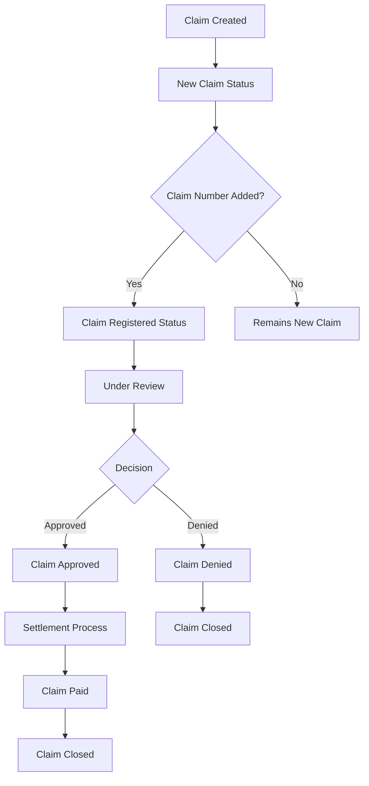

# Claims Module Documentation

## Overview

The Claims Module is a comprehensive insurance claims management system built with Laravel and Vue.js. It handles the entire lifecycle of insurance claims from creation to resolution, supporting multiple lines of business including Car/Motor, Health, Life, and Travel insurance.

## Table of Contents

1. [Architecture Overview](#architecture-overview)
2. [Core Components](#core-components)
3. [Claim Types & Statuses](#claim-types--statuses)
4. [Business Logic & Workflow](#business-logic--workflow)
5. [API Endpoints](#api-endpoints)
6. [Database Schema](#database-schema)
7. [Frontend Components](#frontend-components)
8. [Permissions & Security](#permissions--security)
9. [Integration Points](#integration-points)
10. [Development Guidelines](#development-guidelines)

## Architecture Overview

The Claims Module follows a layered architecture pattern:

```
┌─────────────────────────────────────────┐
│              Frontend Layer             │
│    (Vue.js Components with Inertia)     │
├─────────────────────────────────────────┤
│             Controller Layer            │
│         (ClaimsController)              │
├─────────────────────────────────────────┤
│              Service Layer              │
│         (ClaimsService)                 │
├─────────────────────────────────────────┤
│               Model Layer               │
│  (ClaimRequest, ClaimRequestDetail)     │
├─────────────────────────────────────────┤
│             Database Layer              │
│    (MySQL with Auditing & Soft Deletes) │
└─────────────────────────────────────────┘
```

## Core Components

### 1. Models

#### `ClaimRequest` Model

- **Location**: `app/Models/ClaimRequest.php`
- **Purpose**: Main claim request model with comprehensive business logic
- **Key Features**:
  - Strict typing with `declare(strict_types=1)`
  - Comprehensive relationship management with all related entities
  - Business-specific scopes for filtering and querying
  - Auditable trait for complete audit logging
  - FilterCriteria trait with defined filterable fields
  - Auto-population of default values (source, whatsapp_consent)
  - Business logic methods for status management and assignments

#### `ClaimRequestDetail` Model

- **Location**: `app/Models/ClaimRequestDetail.php`
- **Purpose**: Detailed information for claim requests with LOB-specific fields
- **Key Features**:
  - Car-specific details (make, model, year, plate number)
  - Health-specific details (service types, reference numbers)
  - IP tracking for audit purposes
  - Auditable trait for change tracking
  - FilterCriteria trait for detailed filtering
  - Business logic methods for updating vehicle and service information

#### `ClaimActivity` Model

- **Location**: `app/Models/ClaimActivity.php`
- **Purpose**: Track all claim status changes and activities
- **Key Features**:
  - Status change tracking with timestamps
  - Support for both regular and AI-optimized comments
  - Relationship to claim request and status
  - User tracking for who made changes
  - Static factory method for easy creation
  - Comprehensive scopes for filtering activities

### 2. Controllers

#### `ClaimsController`

- **Location**: `app/Http/Controllers/ClaimsController.php`
- **Purpose**: Main controller handling all claim operations with comprehensive CRUD and business logic
- **Key Methods**:
  - `index(Request $request): Response` - Claims listing with filtering and pagination
  - `create()` - Show claim creation form with dropdown data
  - `store(ClaimStoreRequest $request)` - Create new claim via CAPI integration
  - `show($uuid)` - Display claim details with all relationships and components
  - `edit($uuid)` - Show claim edit form with current data
  - `update(ClaimUpdateRequest $request, $uuid): RedirectResponse` - Update existing claim
  - `updateClaimDetails(ClaimDetailsUpdateRequest $request, ClaimRequest $claim): RedirectResponse` - Update specific claim details
  - `updateClaimStatus(ClaimStatusUpdateRequest $request, ClaimRequest $claim): RedirectResponse` - Update claim status
  - `updateComplaintStatus(ClaimComplaintStatusUpdateRequest $request, ClaimRequest $claim)` - Update complaint status
  - `updateNextFollowUp(ClaimNextFollowUpUpdateRequest $request, ClaimRequest $claim)` - Update next follow-up
  - `searchPolicies(SearchPoliciesRequest $request): JsonResponse` - Search active policies via CAPI
  - `optimizeMessage(Request $request, ClaimStatus $claimStatus): JsonResponse` - AI message optimization
  - `sendNotification(ClaimSendNotificationRequest $request, ClaimRequest $claim): JsonResponse` - Send notifications
  - `getClaimLeadHistory(Request $request, ClaimRequest $claim): JsonResponse` - Get claim status history
  - `getClaimSubStatusLogs(Request $request, ClaimRequest $claim): JsonResponse` - Get sub-status change logs
  - `getComplaintStatusLogs(Request $request, ClaimRequest $claim): JsonResponse` - Get complaint logs
  - `getNextFollowUpLogs(Request $request, ClaimRequest $claim): JsonResponse` - Get follow-up logs
  - `storeDocument(ClaimDocumentRequest $request, ClaimRequest $claim): JsonResponse` - Upload documents
  - `destroyDocument(ClaimRequest $claim, QuoteDocument $document): JsonResponse` - Delete documents
  - `downloadAllDocuments(Request $request, ClaimRequest $claim)` - Download all documents as ZIP
  - `export(ClaimExportValidationRequest $request)` - Export claims data

### 3. Services

#### `ClaimsService`

- **Location**: `app/Services/ClaimsService.php`
- **Purpose**: Comprehensive business logic layer for all claim operations
- **Key Features**:
  - Extends `BaseService` with `CentralTrait` for common functionality
  - Handles CAPI integration for policy search and claim creation
  - Manages complex LOB-specific business rules and validations
  - Implements status transition logic with automatic closure detection
  - Provides dropdown data management for forms
  - Handles document management with S3 integration
  - Supports AI message optimization integration
  - Manages complaint and follow-up workflows
  - Implements comprehensive audit logging and activity tracking
  - Supports export functionality with filtering
  - Optimized query building with eager loading and field selection

### 4. Request Validation

The Claims module implements comprehensive validation through multiple Form Request classes:

#### `ClaimStoreRequest`

- **Purpose**: Validates initial claim creation with full field validation
- **Key Features**: LOB-specific validation, comprehensive field validation, CAPI integration support
- **Validation Patterns**: Name regex, phone regex, email validation, plate number formatting

#### `ClaimDetailsUpdateRequest`

- **Purpose**: Validates claim detail updates with LOB-specific rules
- **Key Features**: Interdependent field validation, conditional LOB validation, business rule enforcement
- **Special Logic**: Car fields are interdependent, Health validation for pending-approvals

#### `ClaimSendNotificationRequest`

- **Purpose**: Validates notification sending with AI optimization
- **Key Features**: Message validation, sub-status validation, AI integration support

#### Other Validation Classes

- `ClaimStatusUpdateRequest` - Status transition validation
- `ClaimComplaintStatusUpdateRequest` - Complaint status updates
- `ClaimNextFollowUpUpdateRequest` - Follow-up scheduling
- `ClaimDocumentRequest` - Document upload validation
- `SearchPoliciesRequest` - CAPI policy search validation

### 5. Observer Pattern

#### `ClaimRequestObserver`

- **Location**: `app/Observers/ClaimRequestObserver.php`
- **Purpose**: Handles automatic business logic triggers based on field changes
- **Key Features**:
  - **Claim Number Monitoring**: Auto-updates sub-status when claim number is entered
  - **Sub-Status Monitoring**: Triggers closure logic based on LOB-specific closure states
  - **Approval Amount Monitoring**: Auto-updates sub-statuses for Car/Bike LOB when amounts are entered
  - **Status Change Monitoring**: Prepared for Google review email dispatch
  - **Comprehensive Logging**: All changes logged with user context

#### Monitored Fields

- `claim_number` - Triggers sub-status update to registered status
- `claim_sub_status_id` - Triggers closure logic evaluation
- `approved_repair_amount` - Car/Bike specific status update
- `approved_total_loss_amount` - Car/Bike specific status update
- `approved_cash_loss_amount` - Car/Bike specific status update
- `claim_status_id` - Future Google review integration

## Business Logic & Workflow

### LOB-Specific Business Rules

#### Car/Motor Claims

- **Required Fields**: plate_number, car_make, car_model, model_year (all interdependent)
- **Status Flow**: New Claim → Claim Registered Awaiting Inspection → Various repair/settlement states
- **Approval Amounts**: Three types - Repair, Total Loss, Cash Loss (each triggers specific status updates)
- **Closure States**: Repair completed and settled, Total loss paid and settled, Cash loss paid and settled, Claim denied, Claim withdrawn

#### Health Claims

- **Request Types**: Reimbursement, Pending Approvals, Ask a Question
- **Required Fields**: claim_request_type_id, service_type_id (for pending approvals)
- **Status Flow**: Different flows based on request type
- **Service Types**: In-patient and Out-patient requests
- **Closure States**: Claim paid, Request approved, Answered & closed, Claim denied, Claim withdrawn

#### Life Claims

- **Simplified Flow**: Basic claim processing with minimal sub-statuses
- **Closure States**: Claim paid, Claim denied

### Status Transition Logic

The Claims module implements sophisticated status transition logic:

1. **Automatic Status Updates**: Observer pattern triggers status updates based on field changes
2. **LOB-Specific Closure Logic**: Different closure criteria for each line of business
3. **Approval-Based Transitions**: Status updates when approval amounts are entered
4. **Business Rule Enforcement**: Validation ensures proper status flow

### Integration Points

#### CAPI Integration

- **Policy Search**: Used only during claim creation for policy lookup
- **Claim Creation**: New claims are created through CAPI integration
- **Error Handling**: Graceful handling of CAPI timeouts and errors

#### AI Integration

- **Message Optimization**: AI-powered customer message optimization
- **Dual Messages**: Support for both customer and AI-optimized messages
- **Integration Points**: Connected to InstantWriter AI service

#### Document Management

- **S3 Integration**: Document storage and retrieval via Azure Storage
- **ZIP Creation**: Bulk document download functionality
- **Document Types**: LOB-specific document type management
- **Security**: Temporary URL generation for secure access

## Frontend Components

The Claims module uses a comprehensive Vue.js component architecture:

### Main Pages

- **`Index.vue`**: Claims listing with advanced filtering and pagination
- **`Show.vue`**: Comprehensive claim details page with all sub-components
- **`Create.vue`**: Claim creation form with policy search integration
- **`Edit.vue`**: Claim editing form with LOB-specific fields
- **`Form.vue`**: Reusable form component

### Component Architecture

- **`ClaimDetails.vue`**: Main claim information display and editing with LOB-specific validation
- **`ClaimStatus.vue`**: Status management by team leads (main claim status updates)
- **`ClaimSubStatusAndCustomerUpdate.vue`**: Sub-status updates with AI-powered customer notifications
- **`ClaimDocuments.vue`**: Document management with upload, view, and bulk download
- **`CustomerDetails.vue`**: Customer information display
- **`ClaimLeadHistory.vue`**: Status change history with client-side pagination
- **`ClaimSubStatusLogs.vue`**: Sub-status change logs with client-side pagination
- **`NextFollowUpUpdate.vue`**: Follow-up scheduling and management
- **`NextFollowUpLogs.vue`**: Follow-up history tracking
- **`ComplaintStatus.vue`**: Complaint management workflow
- **`ComplaintStatusLogs.vue`**: Complaint status history
- **`CustomerAdditionalContacts.vue`**: Additional customer contact management

### Frontend Patterns

- **Composition API**: Modern Vue 3 with `<script setup>` syntax
- **Permission System**: Integrated permission checking with `useCan()` and `useCanAny()`
- **Event-Driven Architecture**: Component communication via custom events
- **Form Validation**: Client-side validation mirroring backend rules
- **Error Handling**: Comprehensive error handling with toast notifications
- **Real-Time Updates**: Partial page reloads using Inertia.js
- **AI Integration**: Message optimization with loading states and user feedback

## Permissions & Security

### Required Permissions

- `CLAIM_LIST` - View claims listing
- `CLAIM_CREATE` - Create new claims
- `CLAIM_EDIT` - Edit existing claims
- `CLAIM_SHOW` - View individual claims
- `CLAIMS_EXPORT_DATA` - Export claim data
- `CLAIMS_STATUS_UPDATE` - Update claim status
- `CLAIMS_SUB_STATUS_UPDATE` - Update claim sub-status
- `CLAIM_DOCUMENT_UPLOAD` - Upload claim documents
- `CLAIM_DOCUMENT_DELETE` - Delete claim documents
- `CLAIM_DOCUMENT_S3_URL` - Get S3 temporary URLs
- `CLAIM_DOWNLOAD_ALL_DOCUMENTS` - Download all documents as ZIP

### Security Features

- **Route Model Binding**: UUID-based routing for enhanced security
- **Permission Middleware**: Applied to all controller methods
- **Input Sanitization**: Comprehensive data cleaning and validation
- **CSRF Protection**: Automatic CSRF token handling
- **Audit Logging**: Complete audit trail for all changes
- **Document Security**: Temporary URL generation for secure document access

## API Endpoints

### Claim Routes

- `GET /claim` - Claims listing (claims.index)
- `GET /claim/create` - Claim creation form (claims.create)
- `POST /claim` - Store new claim (claims.store)
- `GET /claim/{uuid}` - Show claim details (claims.show)
- `GET /claim/{uuid}/edit` - Edit claim form (claims.edit)
- `PUT /claim/{uuid}` - Update claim (claims.update)
- `POST /claim/search-policies` - Search policies via CAPI (claims.search-policies)
- `POST /claim/{uuid}/update-details` - Update claim details (claims.update.details)
- `POST /claim/{uuid}/update-status` - Update claim status (claims.update.status)
- `POST /claim/{uuid}/send-notification` - Send notification (claims.send-notification)
- `GET /claim/{uuid}/lead-history` - Get status history (claims.lead-history)
- `GET /claim/{uuid}/sub-status-logs` - Get sub-status logs (claims.sub-status-logs)

### Document Routes

- `POST /claim/{uuid}/documents` - Upload documents (claims.documents.store)
- `DELETE /claim/{uuid}/documents/{document}` - Delete document (claims.documents.destroy)
- `POST /claim/documents/get-s3-temp-url` - Get S3 temp URL (claims.documents.get-s3-temp-url)
- `GET /claim/{uuid}/documents/download-all` - Download all as ZIP (claims.documents.download-all)

### Additional Routes

- `POST /claim/{uuid}/update-complaint-status` - Update complaint status
- `POST /claim/{uuid}/update-next-follow-up` - Update next follow-up
- `GET /claim/{uuid}/complaint-status-logs` - Get complaint logs
- `GET /claim/{uuid}/next-follow-up-logs` - Get follow-up logs
- `POST /claim/{uuid}/make-additional-contact-primary` - Make contact primary
- `POST /claim/export` - Export claims data

## Development Guidelines

### Code Standards

- **Strict Typing**: All classes use `declare(strict_types=1)`
- **Laravel Conventions**: Follow Laravel directory structure and naming conventions
- **Documentation**: Comprehensive inline documentation with PHPDoc blocks
- **Error Handling**: Comprehensive try-catch blocks with structured logging
- **Validation**: Server-side validation with client-side mirroring

### Testing Strategy

- **Feature Tests**: Controller endpoints with permission testing
- **Unit Tests**: Service layer methods and business logic
- **Database Transactions**: Test isolation with database rollbacks
- **Mock Dependencies**: External APIs and services properly mocked

### Performance Considerations

- **Eager Loading**: Optimized queries with specific field selection
- **Pagination**: Client-side pagination for large datasets
- **Caching**: Strategic caching for dropdown data
- **Query Optimization**: Avoiding N+1 queries through proper relationships

### Maintenance Guidelines

- **Audit Logging**: All changes tracked with user context
- **Error Logging**: Structured logging with contextual data
- **Documentation Updates**: Keep documentation synchronized with code changes
- **Permission Validation**: Regular review of permission requirements
- **Business Rule Validation**: Regular review of LOB-specific rules

## Claim Types & Statuses

### ClaimsEnum Constants Reference

#### Status Type Keys

- `CLAIM_STATUSES_STATUS_KEY = 'statuses'` - Main claim statuses
- `CLAIM_STATUSES_SUB_STATUS_KEY = 'sub-statuses'` - Claim sub-statuses
- `CLAIM_STATUSES_COMPLAINT_STATUS_KEY = 'complaint-statuses'` - Complaint statuses

#### Lookup Keys

- `CLAIM_TYPES_KEY = 'claim-types'` - Claim types lookup
- `CLAIM_REQUEST_TYPES_KEY = 'claim-request-types'` - Health claim request types
- `CLAIM_SERVICE_TYPES_KEY = 'claim-service-types'` - Health service types

#### Main Status Constants

- `CLAIM_STATUS_OPEN = 'Open'` - Open claim status
- `CLAIM_STATUS_CLOSED = 'Close'` - Closed claim status

#### Complaint Status Constants

- `CLAIM_STATUS_OPEN_COMPLAINT = 'Complaint Open'`
- `CLAIM_STATUS_CLOSED_COMPLAINT = 'Complaint Closed'`

### Claim Type Codes

#### Motor/Car Claim Types

- `CLAIM_TYPE_OWN_DAMAGE_CLAIM_CODE = 'own-damage-claim'`
- `CLAIM_TYPE_RECOVERABLE_CLAIM_CODE = 'recoverable-claim'`
- `CLAIM_TYPE_UNKNOWN_DAMAGE_CLAIM_CODE = 'unknown-damage-claim'`
- `CLAIM_TYPE_WATER_DAMAGE_CODE = 'water-damage'`
- `CLAIM_TYPE_THEFT_CODE = 'theft'`
- `CLAIM_TYPE_FIRE_ARSON_CODE = 'fire-arson'`
- `CLAIM_TYPE_WINDSCREEN_ONLY_CODE = 'windscreen-only'`

### Health Claim Request Types

- `CLAIM_REQUEST_TYPE_REIMBURSEMENT_CODE = 'reimbursement'`
- `CLAIM_REQUEST_TYPE_PENDING_APPROVALS_CODE = 'pending-approvals'`
- `CLAIM_REQUEST_TYPE_ASK_A_QUESTION_CODE = 'ask-a-question'`

### Health Service Types

- `CLAIM_SERVICE_TYPE_IN_PATIENT_REQUEST_CODE = 'in-patient-request'`
- `CLAIM_SERVICE_TYPE_OUT_PATIENT_REQUEST_CODE = 'out-patient-request'`

### Sub-Status Constants

#### General Sub-Statuses

- `CLAIM_SUB_STATUS_NEW_CLAIM = 'New claim'`
- `CLAIM_SUB_STATUS_CLAIM_INITIATED = 'Claim initiated'`
- `CLAIM_SUB_STATUS_CLAIM_REGISTERED = 'Claims registered'`
- `CLAIM_SUB_STATUS_CLAIM_REGISTERED_AWAITING_INSPECTION = 'Claim registered and awaiting inspection'`
- `CLAIM_SUB_STATUS_ESTIMATE_UNDER_REVIEW = 'Estimate under review'`
- `CLAIM_SUB_STATUS_SURVEY_IN_PROGRESS = 'Survey in progress'`
- `CLAIM_SUB_STATUS_CLAIM_UNDER_REVIEW = 'Claim under review'`
- `CLAIM_SUB_STATUS_CLAIM_APPROVED = 'Claim approved'`
- `CLAIM_SUB_STATUS_CLAIM_PARTIALLY_APPROVED = 'Claim Partially Approved'`
- `CLAIM_SUB_STATUS_CLAIM_DENIED = 'Claim denied'`
- `CLAIM_SUB_STATUS_CLAIM_WITHDRAWN = 'Claim withdrawn'`
- `CLAIM_SUB_STATUS_CLAIM_CLOSED = 'Claim Closed'`
- `CLAIM_SUB_STATUS_CLAIM_PAID = 'Claim paid'`
- `CLAIM_SUB_STATUS_SETTLEMENT_IN_PROGRESS = 'Settlement in progress'`

#### Motor/Car Specific Sub-Statuses

- `CLAIM_SUB_STATUS_REPAIR_APPROVED_AND_WORK_IN_PROGRESS = 'Repair approved & work in progress'`
- `CLAIM_SUB_STATUS_PARTS_ORDERED = 'Parts ordered'`
- `CLAIM_SUB_STATUS_PARTS_ON_BACKORDER = 'Parts on backorder'`
- `CLAIM_SUB_STATUS_PARTS_DELAYED = 'Parts delayed'`
- `CLAIM_SUB_STATUS_PARTS_ARRIVED_AND_WORK_IN_PROGRESS = 'Parts arrived & work in progress'`
- `CLAIM_SUB_STATUS_HIRE_CAR_REQUESTED = 'Hire car requested'`
- `CLAIM_SUB_STATUS_HIRE_CAR_APPROVED = 'Hire car approved'`
- `CLAIM_SUB_STATUS_HIRE_CAR_REFUND_IN_PROGRESS = 'Hire car refund in progress'`
- `CLAIM_SUB_STATUS_CAR_READY_FOR_COLLECTION = 'Car ready for collection'`
- `CLAIM_SUB_STATUS_REPAIR_COMPLETED = 'Repair completed'`
- `CLAIM_SUB_STATUS_REPAIR_COMPLETED_AND_CLAIM_SETTLED = 'Repair completed and claim settled'`
- `CLAIM_SUB_STATUS_TOTAL_LOSS_APPROVED = 'Total loss approved'`
- `CLAIM_SUB_STATUS_TOTAL_LOSS_OFFER_LETTER_SHARED = 'Total Loss Offer Letter shared'`
- `CLAIM_SUB_STATUS_TOTAL_LOSS_PAYMENT_IN_PROGRESS = 'Total loss payment in progress'`
- `CLAIM_SUB_STATUS_TOTAL_LOSS_PAID_AND_CLAIM_SETTLED = 'Total loss paid and claim settled'`
- `CLAIM_SUB_STATUS_CASH_LOSS_APPROVED = 'Cash loss approved'`
- `CLAIM_SUB_STATUS_CASH_LOSS_PAYMENT_IN_PROGRESS = 'Cash loss payment inprogress'`
- `CLAIM_SUB_STATUS_CASH_LOSS_PAID_AND_CLAIM_SETTLED = 'Cash loss paid and claim settled'`

#### Document Related Sub-Statuses

- `CLAIM_SUB_STATUS_ADDITIONAL_DOCUMENTS_AWAITED = 'Additional documents awaited'`
- `CLAIM_SUB_STATUS_DOCUMENTS_UPLOADED = 'Documents uploaded'`
- `CLAIM_SUB_STATUS_CLAIM_PENDING_FOR_ADDITIONAL_INFORMATION = 'Claim Pending for Additional Information'`

#### Health Specific Sub-Statuses

- `CLAIM_SUB_STATUS_CLAIM_REPROCESSING = 'Claim Reprocessing'`
- `CLAIM_SUB_STATUS_NEW_REQUEST = 'New request'`
- `CLAIM_SUB_STATUS_UNDER_EVALUATION = 'Under Evaluation'`
- `CLAIM_SUB_STATUS_UNDER_RE_EVALUATION = 'Under Re-evaluation'`
- `CLAIM_SUB_STATUS_PARTIALLY_APPROVED = 'Partially Approved'`
- `CLAIM_SUB_STATUS_REQUEST_DENIED = 'Request Denied'`
- `CLAIM_SUB_STATUS_REQUEST_APPROVED = 'Request Approved'`
- `CLAIM_SUB_STATUS_UNDER_REVIEW = 'Under Review'`
- `CLAIM_SUB_STATUS_ANSWERED_AND_CLOSED = 'Answered & Closed'`

#### Legacy Sub-Statuses

- `CLAIM_SUB_STATUS_PAYMENT_INITIATED = 'Payment initiated'`
- `CLAIM_SUB_STATUS_PAYMENT_COMPLETED = 'Payment completed'`

### Helper Methods in ClaimsEnum

#### Grouped Status Methods

- `getClaimTypeCodes(): array` - Returns all claim type codes
- `getClaimRequestTypeCodes(): array` - Returns all request type codes
- `getClaimServiceTypeCodes(): array` - Returns all service type codes
- `getClaimRequestAccessTypeCodes(): array` - Returns access type codes
- `getClaimSubStatuses(): array` - Returns all sub-status values

#### LOB-Specific Status Methods

- `getMotorClaimSubStatuses(): array` - Returns motor/car specific sub-statuses
- `getHealthReimbursementClaimSubStatuses(): array` - Returns health reimbursement sub-statuses
- `getHealthPendingApprovalsSubStatuses(): array` - Returns health pending approvals sub-statuses
- `getHealthAskQuestionSubStatuses(): array` - Returns health ask question sub-statuses

### Status Transition Logic

#### Motor/Car Claims Closure States

- `REPAIR_COMPLETED_AND_CLAIM_SETTLED`
- `TOTAL_LOSS_PAID_AND_CLAIM_SETTLED`
- `CASH_LOSS_PAID_AND_CLAIM_SETTLED`
- `CLAIM_WITHDRAWN`
- `CLAIM_DENIED`

#### Health Claims Closure States

- `CLAIM_PAID`
- `REQUEST_APPROVED`
- `ANSWERED_AND_CLOSED`
- `CLAIM_DENIED`
- `CLAIM_WITHDRAWN`

#### Life Claims Closure States

- `CLAIM_PAID`
- `CLAIM_DENIED`

### Claim Types

#### Motor/Car Claims

- **Own Damage Claim** (`own-damage-claim`)
- **Recoverable Claim** (`recoverable-claim`)
- **Unknown Damage Claim** (`unknown-damage-claim`)
- **Water Damage** (`water-damage`)
- **Theft** (`theft`)
- **Fire/Arson** (`fire-arson`)
- **Windscreen Only** (`windscreen-only`)

#### Health Claims

- **Reimbursement** (`reimbursement`)
- **Pending Approvals** (`pending-approvals`)
- **Ask a Question** (`ask-a-question`)

#### Service Types (Health)

- **In-Patient Request** (`in-patient-request`)
- **Out-Patient Request** (`out-patient-request`)

### Claim Statuses

#### Main Statuses

- **Open** - Active claims requiring attention
- **Closed** - Resolved claims

#### Sub-Statuses Workflow

##### General Workflow

1. **New Claim** - Initial status when claim is created
2. **Claim Initiated** - Claim processing has begun
3. **Claim Registered** - Claim officially registered in system
4. **Claim Under Review** - Being evaluated by claims team
5. **Claim Approved/Denied** - Decision made
6. **Claim Paid** - Settlement completed

##### Motor-Specific Workflow

1. **Claim Registered and Awaiting Inspection**
2. **Estimate Under Review**
3. **Survey in Progress**
4. **Repair Completed and Claim Settled**
5. **Total Loss Paid and Claim Settled**
6. **Cash Loss Paid and Claim Settled**

##### Health-Specific Workflow

- **Pending Approvals**: New Request → Under Evaluation → Request Approved/Denied
- **Ask a Question**: Under Review → Answered & Closed

## Business Logic & Workflow

### Claim Lifecycle



### Automatic Status Updates

The system automatically updates claim statuses based on:

1. **Claim Number Addition**: When a claim number is added, status changes to "Claim Registered"
2. **Sub-Status Changes**: Main status automatically updates based on sub-status
3. **Settlement Completion**: Status changes to "Closed" when settlement is complete

### Business Rules

#### Status Transition Rules

- Claims automatically close when reaching terminal sub-statuses
- Complaint status affects main claim status
- Manager assignment triggers date tracking
- Follow-up dates enable overdue tracking

#### LOB-Specific Rules

- **Car Claims**: Require vehicle details (make, model, year, plate number)
- **Health Claims**: Require service type for pending approvals
- **All Claims**: Require incident date and claim type

#### Dynamic Field Management

- **Model-Based Fillable**: Uses `getFillable()` from models for dynamic field handling
- **Form-Specific Fields**: Additional fields like `incident_story`, `whatsapp_consent` added programmatically
- **Filtered Updates**: Specific methods use `array_intersect()` to limit fields for targeted updates
- **Automatic Sync**: Field definitions automatically stay in sync with model changes

## API Endpoints

### Web Routes

| Method | Endpoint                                 | Name                       | Purpose             |
| ------ | ---------------------------------------- | -------------------------- | ------------------- |
| GET    | `/claims`                                | `claims.index`             | List claims         |
| GET    | `/claim/create`                          | `claims.create`            | Show create form    |
| POST   | `/claim`                                 | `claims.store`             | Create claim        |
| GET    | `/claim/{uuid}`                          | `claims.show`              | Show claim details  |
| GET    | `/claim/{uuid}/edit`                     | `claims.edit`              | Show edit form      |
| PUT    | `/claim/{uuid}`                          | `claims.update`            | Update claim        |
| POST   | `/claim/search-policies`                 | `claims.search-policies`   | Search policies     |
| POST   | `/claim/update-details/{uuid}`           | `claims.update.details`    | Update details      |
| POST   | `/claim/update-statuses/{uuid}`          | `claims.update.status`     | Update status       |
| POST   | `/claims/{claim:uuid}/send-notification` | `claims.send-notification` | Send notification   |
| POST   | `/claims/{claim:uuid}/complaint-status`  | `claims.complaint-status`  | Update complaint    |
| POST   | `/claims/{claim:uuid}/next-follow-up`    | `claims.next-follow-up`    | Update follow-up    |
| GET    | `/claims/{claim:uuid}/lead-history`      | `claims.lead-history`      | Get status history  |
| GET    | `/claims/{claim:uuid}/sub-status-logs`   | `claims.sub-status-logs`   | Get sub-status logs |

### API Response Format

```json
{
  "success": true,
  "data": {
    // Response data
  },
  "message": "Operation completed successfully"
}
```

### Error Response Format

```json
{
  "success": false,
  "message": "Error description",
  "errors": {
    "field_name": ["Validation error message"]
  }
}
```

## Database Schema

### Primary Tables

#### `claim_requests` Table

- Primary key: `id`
- UUID: `uuid` for routing
- Code: `code` for reference
- Foreign keys: `quote_type_id`, `claim_status_id`, `claim_sub_status_id`
- Manager tracking: `manager_id`, `manager_assigned_date`
- Financial fields: `approved_repair_amount`, `approved_total_loss_amount`

#### `claim_request_details` Table

- Primary key: `id`
- Foreign key: `claim_request_id`
- Car details: `car_make`, `car_model`, `model_year`, `plate_number`
- Health details: `service_type_id`, `request_reference_number`
- Tracking: `user_ip`

### Relationships

```
ClaimRequest (1) --> (1) ClaimRequestDetail
ClaimRequest (*) --> (1) User (manager)
ClaimRequest (*) --> (1) QuoteType
ClaimRequest (*) --> (1) ClaimStatus
ClaimRequest (*) --> (1) ClaimSubStatus
ClaimRequest (1) --> (*) Activities
ClaimRequest (1) --> (*) Documents (polymorphic)
```

## Frontend Components

### Vue.js Components

#### Main Pages

- **`Claims/Index.vue`** - Claims listing with filters
- **`Claims/Show.vue`** - Claim details view
- **`Claims/Create.vue`** - Claim creation form
- **`Claims/Edit.vue`** - Claim editing form

#### Component Structure

- **`Claims/Components/ClaimDetails.vue`** - Claim details component
- **`Claims/Components/ClaimStatus.vue`** - Status management component
- **`Claims/Components/ClaimDocuments.vue`** - Document management

#### Key Frontend Features

- **Permission-based UI**: Uses `useCan()` composable
- **Real-time Validation**: Mirrors backend validation
- **Reactive Dropdowns**: Based on LOB selection
- **Error Handling**: Comprehensive toast notifications
- **Data Transformation**: Consistent data formatting

### Component Patterns

```vue
<script setup>
// Permission checking
const can = permission => useCan(permission);

// Form handling
const form = useForm({
  // Form data
});

// Validation that mirrors backend
const validateForm = () => {
  // Custom validation logic
};

// Error handling
const notification = useToast();
</script>
```

## Permissions & Security

### Permission Constants

From `PermissionsEnum`:

- `CLAIM_LIST` - View claims list
- `CLAIM_CREATE` - Create new claims
- `CLAIM_EDIT` - Edit existing claims
- `CLAIM_SHOW` - View claim details
- `CLAIMS_EXPORT_DATA` - Export claims data

### Security Features

1. **UUID-based Routing** - Prevents ID enumeration
2. **Permission Middleware** - Controller-level access control
3. **Input Sanitization** - All inputs trimmed and normalized
4. **SQL Injection Prevention** - Eloquent ORM only
5. **CSRF Protection** - Automatic token validation
6. **Audit Logging** - Complete change tracking

### Role-based Access

- **Claims Managers** - Full access to assigned claims
- **Admins** - Full system access
- **SuperAdmins** - Complete administrative access

## Integration Points

### External Services

#### CAPI Integration

- **Endpoint**: `/api/v2-save-claim`
- **Purpose**: External claim creation
- **Data Flow**: Frontend → ClaimsService → CAPI → Database

#### Bird Service Integration

- **Purpose**: Email notifications and workflows
- **Configuration**: `ApplicationStorageEnums::BIRD_NB_MOTOR_WORKFLOW`
- **Data**: Customer details, advisor information, workflow triggers

### Internal Integrations

#### Quote System Integration

- **Policy Search**: Active policy lookup for claim creation
- **Customer Data**: Pre-populate claim forms from policy data
- **Advisor Assignment**: Automatic advisor linking

#### Document Management

- **Polymorphic Relations**: Claims can have multiple document types
- **Document Categories**: Claim-specific document categorization
- **Upload Tracking**: Complete audit trail for documents
- **ZIP Creation**: Bulk document download functionality
- **Document Validation**: File existence and structure validation
- **Azure Storage Integration**: Documents stored on Azure blob storage

## Development Guidelines

### Code Standards

#### PHP Standards

- Use `declare(strict_types=1)` in all files
- Follow PSR-12 coding standards
- Implement comprehensive error handling
- Use typed properties and return types

#### Laravel Patterns

- Extend `BaseService` for service classes
- Use `CentralTrait` for common functionality
- Implement `FormRequest` for validation
- Use observers for business logic triggers
- Leverage model `getFillable()` for dynamic field handling
- Use `array_intersect()` for filtered field updates
- Implement proper exception handling with structured logging
- Use `RolesEnum` for role-based access control

#### Vue.js Patterns

- Use Composition API with `<script setup>`
- Implement permission checks with `useCan()`
- Mirror backend validation in frontend
- Use consistent error handling patterns

### Testing Strategy

#### Feature Tests

- Test all controller endpoints
- Verify permission-based access
- Test complete user workflows
- Mock external dependencies

#### Unit Tests

- Test service layer methods
- Test model relationships and scopes
- Test validation logic
- Test business rule implementations

### Performance Considerations

1. **Query Optimization**

   - Use eager loading with specific field selection
   - Implement proper database indexing
   - Use `simplePaginate()` for large datasets

2. **Caching Strategy**

   - Cache dropdown data
   - Cache frequently accessed lookups
   - Implement query result caching

3. **Frontend Optimization**
   - Lazy load components
   - Implement virtual scrolling for large lists
   - Use computed properties for reactive data

### Maintenance & Updates

#### Update Protocol

1. Review current patterns before making changes
2. Update documentation with new features
3. Update cursor rules (`.cursor/rules/claim-module-architecture.mdc`) with new patterns
4. Validate security implementations
5. Test pattern consistency across modules
6. Update frontend patterns to align with backend
7. Verify permission systems after changes
8. Ensure proper logging implementation
9. Review performance impact
10. Update inline documentation

#### Monitoring & Logging

- All actions logged with `LoggerService`
- Structured logging with context data
- User ID tracking in all operations
- Error logging with stack traces
- Performance monitoring for slow queries

---

## Quick Reference

### Key Files

- **Controller**: `app/Http/Controllers/ClaimsController.php`
- **Service**: `app/Services/ClaimsService.php`
- **Models**: `app/Models/ClaimRequest.php`, `app/Models/ClaimRequestDetail.php`
- **Observer**: `app/Observers/ClaimRequestObserver.php`
- **Enums**: `app/Enums/ClaimsEnum.php`
- **Frontend**: `resources/js/inertia/Pages/Claims/`

### Common Commands

```bash
# Run claim-related tests
php artisan test --filter=Claims

# Seed claim statuses
php artisan db:seed --class=ClaimStatusesSeeder

# Clear claim-related cache
php artisan cache:forget claims.*
```

### Support Contacts

- **Development Team**: [Your team contact]
- **Business Analyst**: [BA contact]
- **System Administrator**: [Admin contact]

---

_Last Updated: [Current Date]_
_Version: 1.0_
