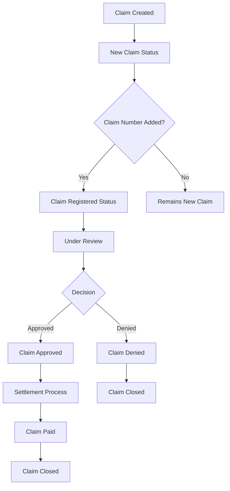

# Claims Module Documentation

## Overview

The Claims Module is a comprehensive insurance claims management system built with Laravel and Vue.js. It handles the entire lifecycle of insurance claims from creation to resolution, supporting multiple lines of business including Car/Motor, Health, Life, and Travel insurance.

## Table of Contents

1. [Architecture Overview](#architecture-overview)
2. [Core Components](#core-components)
3. [Claim Types & Statuses](#claim-types--statuses)
4. [Business Logic & Workflow](#business-logic--workflow)
5. [API Endpoints](#api-endpoints)
6. [Database Schema](#database-schema)
7. [Frontend Components](#frontend-components)
8. [Permissions & Security](#permissions--security)
9. [Integration Points](#integration-points)
10. [Development Guidelines](#development-guidelines)

## Architecture Overview

The Claims Module follows a layered architecture pattern:

```
┌─────────────────────────────────────────┐
│              Frontend Layer             │
│    (Vue.js Components with Inertia)     │
├─────────────────────────────────────────┤
│             Controller Layer            │
│         (ClaimsController)              │
├─────────────────────────────────────────┤
│              Service Layer              │
│         (ClaimsService)                 │
├─────────────────────────────────────────┤
│               Model Layer               │
│  (ClaimRequest, ClaimRequestDetail)     │
├─────────────────────────────────────────┤
│             Database Layer              │
│    (MySQL with Auditing & Soft Deletes) │
└─────────────────────────────────────────┘
```

## Core Components

### 1. Models

#### `ClaimRequest` Model

- **Location**: `app/Models/ClaimRequest.php`
- **Purpose**: Main claim request model with comprehensive business logic
- **Key Features**:
  - Strict typing with `declare(strict_types=1)`
  - Comprehensive relationship management with all related entities
  - Business-specific scopes for filtering and querying
  - Auditable trait for complete audit logging
  - FilterCriteria trait with defined filterable fields
  - Auto-population of default values (source, whatsapp_consent)
  - Business logic methods for status management and assignments

#### `ClaimRequestDetail` Model

- **Location**: `app/Models/ClaimRequestDetail.php`
- **Purpose**: Detailed information for claim requests with LOB-specific fields
- **Key Features**:
  - Car-specific details (make, model, year, plate number)
  - Health-specific details (service types, reference numbers)
  - IP tracking for audit purposes
  - Auditable trait for change tracking
  - FilterCriteria trait for detailed filtering
  - Business logic methods for updating vehicle and service information

#### `ClaimActivity` Model

- **Location**: `app/Models/ClaimActivity.php`
- **Purpose**: Track all claim status changes and activities
- **Key Features**:
  - Status change tracking with timestamps
  - Support for both regular and AI-optimized comments
  - Relationship to claim request and status
  - User tracking for who made changes
  - Static factory method for easy creation
  - Comprehensive scopes for filtering activities

### 2. Controllers

#### `ClaimsController`

- **Location**: `app/Http/Controllers/ClaimsController.php`
- **Purpose**: Main controller handling all claim operations with comprehensive CRUD and business logic
- **Key Methods**:
  - `index(Request $request): Response` - Claims listing with filtering and pagination
  - `create()` - Show claim creation form with dropdown data
  - `store(ClaimStoreRequest $request)` - Create new claim via CAPI integration
  - `show($uuid)` - Display claim details with all relationships and components
  - `edit($uuid)` - Show claim edit form with current data
  - `update(ClaimUpdateRequest $request, $uuid): RedirectResponse` - Update existing claim
  - `updateClaimDetails(ClaimDetailsUpdateRequest $request, ClaimRequest $claim): RedirectResponse` - Update specific claim details
  - `updateClaimStatus(ClaimStatusUpdateRequest $request, ClaimRequest $claim): RedirectResponse` - Update claim status
  - `updateComplaintStatus(ClaimComplaintStatusUpdateRequest $request, ClaimRequest $claim)` - Update complaint status
  - `updateNextFollowUp(ClaimNextFollowUpUpdateRequest $request, ClaimRequest $claim)` - Update next follow-up
  - `searchPolicies(SearchPoliciesRequest $request): JsonResponse` - Search active policies via CAPI
  - `optimizeMessage(Request $request, ClaimStatus $claimStatus): JsonResponse` - AI message optimization
  - `sendNotification(ClaimSendNotificationRequest $request, ClaimRequest $claim): JsonResponse` - Send notifications
  - `getClaimLeadHistory(Request $request, ClaimRequest $claim): JsonResponse` - Get claim status history
  - `getClaimSubStatusLogs(Request $request, ClaimRequest $claim): JsonResponse` - Get sub-status change logs
  - `getComplaintStatusLogs(Request $request, ClaimRequest $claim): JsonResponse` - Get complaint logs
  - `getNextFollowUpLogs(Request $request, ClaimRequest $claim): JsonResponse` - Get follow-up logs
  - `storeDocument(ClaimDocumentRequest $request, ClaimRequest $claim): JsonResponse` - Upload documents
  - `destroyDocument(ClaimRequest $claim, QuoteDocument $document): JsonResponse` - Delete documents
  - `downloadAllDocuments(Request $request, ClaimRequest $claim)` - Download all documents as ZIP
  - `export(ClaimExportValidationRequest $request)` - Export claims data

### 3. Services

#### `ClaimsService`

- **Location**: `app/Services/ClaimsService.php`
- **Purpose**: Comprehensive business logic layer for all claim operations
- **Key Features**:
  - Extends `BaseService` with `CentralTrait` for common functionality
  - Pre-configured query builders in constructor with optimized field selection and eager loading
  - Comprehensive filtering system supporting exact, partial, date range, and nested relationship filters
  - Handles CAPI integration for policy search during claim creation only
  - Manages complex LOB-specific business rules and validations
  - Implements status transition logic with automatic closure detection based on LOB
  - Provides comprehensive dropdown data management for forms (LOB, statuses, types, managers, car data)
  - Handles document management with Azure Storage (upload, delete, ZIP creation)
  - Supports AI message optimization via InstantWriter facade
  - Manages complaint status with automatic claim reopening logic
  - Manages follow-up workflows with datetime tracking
  - Retrieves history/logs from claim_activities and audits tables for client-side pagination
  - Implements comprehensive audit logging with user context via LoggerService
  - Supports export functionality with same filtering as listing
  - Observer helper methods for automatic status updates based on field changes

### 4. Request Validation

The Claims module implements comprehensive validation through multiple Form Request classes:

#### `ClaimStoreRequest`

- **Purpose**: Validates initial claim creation with full field validation
- **Key Features**: LOB-specific validation, comprehensive field validation, CAPI integration support
- **Validation Patterns**: Name regex, phone regex, email validation, plate number formatting

#### `ClaimDetailsUpdateRequest`

- **Purpose**: Validates claim detail updates with LOB-specific rules
- **Key Features**: Interdependent field validation, conditional LOB validation, business rule enforcement
- **Special Logic**: Car fields are interdependent, Health validation for pending-approvals

#### `ClaimSendNotificationRequest`

- **Purpose**: Validates notification sending with AI optimization
- **Key Features**: Message validation, sub-status validation, AI integration support

#### Other Validation Classes

- `ClaimStatusUpdateRequest` - Status transition validation
- `ClaimComplaintStatusUpdateRequest` - Complaint status updates
- `ClaimNextFollowUpUpdateRequest` - Follow-up scheduling
- `ClaimDocumentRequest` - Document upload validation
- `SearchPoliciesRequest` - CAPI policy search validation

### 5. Observer Pattern

#### `ClaimRequestObserver`

- **Location**: `app/Observers/ClaimRequestObserver.php`
- **Purpose**: Handles automatic business logic triggers based on field changes using Eloquent observers
- **Key Features**:
  - **Strict Typing**: Uses `declare(strict_types=1)` for type safety
  - **Service Integration**: Creates ClaimsService instance to handle business logic
  - **Field Change Detection**: Uses `isDirty()` and `getOriginal()` for precise change tracking
  - **Empty-to-Filled Logic**: Only triggers updates when values change from empty to filled (prevents duplicate triggers)
  - **LOB-Aware Logic**: Uses `isCarOrBikeLOB()` helper method for conditional approval amount monitoring
  - **Two-Phase Lifecycle**: Implements both `creating()` and `updating()` events

#### Observer Lifecycle Events

**`creating(ClaimRequest $claimRequest)` Event:**

- Triggered before new claim is saved to database
- Checks if `claim_number` is already provided during creation
- If claim_number exists, immediately sets appropriate registered status
- Useful for batch imports or API-created claims with pre-existing claim numbers

**`updating(ClaimRequest $claimRequest)` Event:**

- Triggered before claim updates are saved
- Monitors multiple fields for changes using `isDirty()` method
- Implements conditional logic based on LOB type
- Executes appropriate service methods for status updates
- All status changes happen before database commit

#### Monitored Fields & Triggers

| Field                        | Trigger Condition          | Action                                                                                   | LOB-Specific                               |
| ---------------------------- | -------------------------- | ---------------------------------------------------------------------------------------- | ------------------------------------------ |
| `claim_number`               | Empty → Filled             | `updateClaimSubStatusToClaimRegistered()`                                                | Car LOB gets "awaiting inspection" variant |
| `claim_sub_status_id`        | Any change                 | Check closure with `checkSubStatusForClaimClosure()`, call `markClaimAsClosed()` if true | Yes - different closure states per LOB     |
| `approved_repair_amount`     | Empty → Filled             | `updateClaimSubStatusToRepairApprovedAndWIP()`                                           | Car/Bike only                              |
| `approved_total_loss_amount` | Empty → Filled             | `updateClaimSubStatusToTotalLossOfferLetterShared()`                                     | Car/Bike only                              |
| `approved_cash_loss_amount`  | Empty → Filled             | `updateClaimSubStatusToCashLossApproved()`                                               | Car/Bike only                              |
| `claim_status_id`            | Any change (commented out) | `dispatchGoogleReviewEmail()` when closing                                               | Future feature                             |

#### Observer Design Patterns

- **Guard Clauses**: Checks `if (empty($original) && !empty($new))` to prevent duplicate triggers
- **Service Delegation**: All business logic delegated to ClaimsService methods (SRP)
- **No Direct DB Queries**: Uses model methods and relationships only
- **Logging in Service**: Observer focuses on detection, service handles logging
- **Idempotent Operations**: Service methods handle their own status lookups and validations

## Business Logic & Workflow

### LOB-Specific Business Rules

#### Car/Motor Claims

- **Required Fields**: plate_number, car_make, car_model, model_year (all interdependent)
- **Status Flow**: New Claim → Claim Registered Awaiting Inspection → Various repair/settlement states
- **Approval Amounts**: Three types - Repair, Total Loss, Cash Loss (each triggers specific status updates)
- **Closure States**: Repair completed and settled, Total loss paid and settled, Cash loss paid and settled, Claim denied, Claim withdrawn

#### Health Claims

- **Request Types**: Reimbursement, Pending Approvals, Ask a Question
- **Required Fields**: claim_request_type_id, service_type_id (for pending approvals)
- **Status Flow**: Different flows based on request type
- **Service Types**: In-patient and Out-patient requests
- **Closure States**: Claim paid, Request approved, Answered & closed, Claim denied, Claim withdrawn

#### Life Claims

- **Simplified Flow**: Basic claim processing with minimal sub-statuses
- **Closure States**: Claim paid, Claim denied

### Status Transition Logic

The Claims module implements sophisticated status transition logic through the `ClaimRequestObserver`:

1. **Automatic Status Updates**: Observer pattern triggers status updates based on field changes

   - Monitors `claim_number`, `claim_sub_status_id`, `approved_repair_amount`, `approved_total_loss_amount`, `approved_cash_loss_amount`, `claim_status_id`
   - Only triggers updates when values change from empty to filled
   - Calls ClaimsService methods for status updates

2. **LOB-Specific Closure Logic**: Different closure criteria for each line of business

   - **Car/Motor**: Repair completed and settled, Total loss paid and settled, Cash loss paid and settled, Claim withdrawn, Claim denied
   - **Health**: Claim paid, Request approved, Answered & closed, Claim denied, Claim withdrawn
   - **Life**: Claim paid, Claim denied
   - Implemented in `checkSubStatusForClaimClosure()` method

3. **Approval-Based Transitions**: Car/Bike LOB only - Status updates when approval amounts are entered

   - `approved_repair_amount` → "Repair approved & work in progress"
   - `approved_total_loss_amount` → "Total Loss Offer Letter shared"
   - `approved_cash_loss_amount` → "Cash loss approved"

4. **Complaint Status Logic**: Opening a complaint automatically reopens a closed claim

   - Implemented in `updateComplaintStatus()` service method

5. **Business Rule Enforcement**: Validation ensures proper status flow at controller and request validation layers

### Integration Points

#### CAPI Integration

- **Policy Search**: Used only during claim creation for policy lookup via `searchActivePolicies()` method
  - Searches `personal_quotes` table with active policy status
  - Supports filtering by email, policy number, and quote type
  - Includes Car-specific fields (make, model, year, plate) via conditional joins
  - Returns paginated results with 15 items per page
- **Claim Creation**: New claims are created through CAPI endpoint `/api/claims/save-claim` via CustomerPortalApiFacade
  - Transforms form data to API format
  - Filters out null values before sending
  - Includes LOB-specific fields (car details for Car LOB, health details for Health LOB)
- **Error Handling**: Comprehensive error logging with structured context via LoggerService

#### AI Integration

- **Message Optimization**: AI-powered customer message optimization via InstantWriter facade
  - Endpoint: `/message-optimizer/optimize` (POST)
  - Sends original message and claim reference UUID
  - Returns optimized message for professional customer communication
  - Used in claim sub-status update and notification workflow
- **Dual Messages**: Support for both customer and AI-optimized messages stored in ClaimActivity
  - `comment` field stores original customer message
  - `comment_ai` field stores AI-optimized version
- **Integration Points**: Connected to InstantWriterAIFacade for external AI service communication
- **Error Handling**: Comprehensive logging with message context for debugging

#### Document Management

- **S3 Integration**: Document storage and retrieval via Azure Storage
- **ZIP Creation**: Bulk document download functionality
- **Document Types**: LOB-specific document type management
- **Security**: Temporary URL generation for secure access

## Frontend Components

The Claims module uses a comprehensive Vue.js component architecture:

### Main Pages

- **`Index.vue`**: Claims listing with advanced filtering and pagination
- **`Show.vue`**: Comprehensive claim details page with all sub-components
- **`Create.vue`**: Claim creation form with policy search integration
- **`Edit.vue`**: Claim editing form with LOB-specific fields
- **`Form.vue`**: Reusable form component

### Component Architecture

- **`ClaimDetails.vue`**: Main claim information display and editing with LOB-specific validation
- **`ClaimStatus.vue`**: Status management by team leads (main claim status updates)
- **`ClaimSubStatusAndCustomerUpdate.vue`**: Sub-status updates with AI-powered customer notifications
- **`ClaimDocuments.vue`**: Document management with upload, view, and bulk download
- **`CustomerDetails.vue`**: Customer information display
- **`ClaimLeadHistory.vue`**: Status change history with client-side pagination
- **`ClaimSubStatusLogs.vue`**: Sub-status change logs with client-side pagination
- **`NextFollowUpUpdate.vue`**: Follow-up scheduling and management
- **`NextFollowUpLogs.vue`**: Follow-up history tracking
- **`ComplaintStatus.vue`**: Complaint management workflow
- **`ComplaintStatusLogs.vue`**: Complaint status history
- **`CustomerAdditionalContacts.vue`**: Additional customer contact management

### Frontend Patterns

- **Composition API**: Modern Vue 3 with `<script setup>` syntax
- **Permission System**: Integrated permission checking with `useCan()` and `useCanAny()`
- **Event-Driven Architecture**: Component communication via custom events
- **Form Validation**: Client-side validation mirroring backend rules
- **Error Handling**: Comprehensive error handling with toast notifications
- **Real-Time Updates**: Partial page reloads using Inertia.js
- **AI Integration**: Message optimization with loading states and user feedback

## Permissions & Security

### Required Permissions

- `CLAIM_LIST` - View claims listing
- `CLAIM_CREATE` - Create new claims
- `CLAIM_EDIT` - Edit existing claims
- `CLAIM_SHOW` - View individual claims
- `CLAIMS_EXPORT_DATA` - Export claim data
- `CLAIMS_STATUS_UPDATE` - Update claim status
- `CLAIMS_SUB_STATUS_UPDATE` - Update claim sub-status
- `CLAIM_DOCUMENT_UPLOAD` - Upload claim documents
- `CLAIM_DOCUMENT_DELETE` - Delete claim documents
- `CLAIM_DOCUMENT_S3_URL` - Get S3 temporary URLs
- `CLAIM_DOWNLOAD_ALL_DOCUMENTS` - Download all documents as ZIP

### Security Features

- **Route Model Binding**: UUID-based routing for enhanced security
- **Permission Middleware**: Applied to all controller methods
- **Input Sanitization**: Comprehensive data cleaning and validation
- **CSRF Protection**: Automatic CSRF token handling
- **Audit Logging**: Complete audit trail for all changes
- **Document Security**: Temporary URL generation for secure document access

## API Endpoints

### Claim Routes

- `GET /claim` - Claims listing (claims.index)
- `GET /claim/create` - Claim creation form (claims.create)
- `POST /claim` - Store new claim (claims.store)
- `GET /claim/{uuid}` - Show claim details (claims.show)
- `GET /claim/{uuid}/edit` - Edit claim form (claims.edit)
- `PUT /claim/{uuid}` - Update claim (claims.update)
- `POST /claim/search-policies` - Search policies via CAPI (claims.search-policies)
- `POST /claim/{uuid}/update-details` - Update claim details (claims.update.details)
- `POST /claim/{uuid}/update-status` - Update claim status (claims.update.status)
- `POST /claim/{uuid}/send-notification` - Send notification (claims.send-notification)
- `GET /claim/{uuid}/lead-history` - Get status history (claims.lead-history)
- `GET /claim/{uuid}/sub-status-logs` - Get sub-status logs (claims.sub-status-logs)

### Document Routes

| Method | Endpoint                                     | Name                               | Purpose                                | Permission                   |
| ------ | -------------------------------------------- | ---------------------------------- | -------------------------------------- | ---------------------------- |
| POST   | `/claim/{claim:uuid}/documents`              | `claims.documents.store`           | Upload documents (multi-file support)  | CLAIM_DOCUMENT_UPLOAD        |
| DELETE | `/claim/{claim:uuid}/documents/{document}`   | `claims.documents.destroy`         | Delete document with validation        | CLAIM_DOCUMENT_DELETE        |
| POST   | `/claim/documents/get-s3-temp-url`           | `claims.documents.get-s3-temp-url` | Get Azure Storage temp URL for viewing | CLAIM_DOCUMENT_S3_URL        |
| GET    | `/claim/{claim:uuid}/documents/download-all` | `claims.documents.download-all`    | Download all as ZIP                    | CLAIM_DOWNLOAD_ALL_DOCUMENTS |

### Route Binding Patterns

**Standard UUID Binding:**

- Most routes use `{uuid}` parameter matching against `ClaimRequest.uuid` field
- Controller methods receive UUID as string parameter

**Route Model Binding:**

- Routes with `{claim:uuid}` automatically bind to ClaimRequest model by UUID field
- Controller methods receive ClaimRequest model instance directly
- Laravel automatically returns 404 if claim not found

**Special Bindings:**

- `{claimStatus}` in optimize-message route binds to ClaimStatus model
- `{document}` in document delete route binds to QuoteDocument model

## Development Guidelines

### Code Standards

- **Strict Typing**: All classes use `declare(strict_types=1)`
- **Laravel Conventions**: Follow Laravel directory structure and naming conventions
- **Documentation**: Comprehensive inline documentation with PHPDoc blocks
- **Error Handling**: Comprehensive try-catch blocks with structured logging
- **Validation**: Server-side validation with client-side mirroring

### Testing Strategy

- **Feature Tests**: Controller endpoints with permission testing
- **Unit Tests**: Service layer methods and business logic
- **Database Transactions**: Test isolation with database rollbacks
- **Mock Dependencies**: External APIs and services properly mocked

### Performance Considerations

- **Eager Loading**: Optimized queries with specific field selection
- **Pagination**: Client-side pagination for large datasets
- **Caching**: Strategic caching for dropdown data
- **Query Optimization**: Avoiding N+1 queries through proper relationships

### Maintenance Guidelines

- **Audit Logging**: All changes tracked with user context
- **Error Logging**: Structured logging with contextual data
- **Documentation Updates**: Keep documentation synchronized with code changes
- **Permission Validation**: Regular review of permission requirements
- **Business Rule Validation**: Regular review of LOB-specific rules

## Claim Types & Statuses

### ClaimsEnum Constants Reference

#### Status Type Keys

- `CLAIM_STATUSES_STATUS_KEY = 'statuses'` - Main claim statuses
- `CLAIM_STATUSES_SUB_STATUS_KEY = 'sub-statuses'` - Claim sub-statuses
- `CLAIM_STATUSES_COMPLAINT_STATUS_KEY = 'complaint-statuses'` - Complaint statuses

#### Lookup Keys

- `CLAIM_TYPES_KEY = 'claim-types'` - Claim types lookup
- `CLAIM_REQUEST_TYPES_KEY = 'claim-request-types'` - Health claim request types
- `CLAIM_SERVICE_TYPES_KEY = 'claim-service-types'` - Health service types

#### Main Status Constants

- `CLAIM_STATUS_OPEN = 'Open'` - Open claim status
- `CLAIM_STATUS_CLOSED = 'Close'` - Closed claim status

#### Complaint Status Constants

- `CLAIM_STATUS_OPEN_COMPLAINT = 'Complaint Open'`
- `CLAIM_STATUS_CLOSED_COMPLAINT = 'Complaint Closed'`

### Claim Type Codes

#### Motor/Car Claim Types

- `CLAIM_TYPE_OWN_DAMAGE_CLAIM_CODE = 'own-damage-claim'`
- `CLAIM_TYPE_RECOVERABLE_CLAIM_CODE = 'recoverable-claim'`
- `CLAIM_TYPE_UNKNOWN_DAMAGE_CLAIM_CODE = 'unknown-damage-claim'`
- `CLAIM_TYPE_WATER_DAMAGE_CODE = 'water-damage'`
- `CLAIM_TYPE_THEFT_CODE = 'theft'`
- `CLAIM_TYPE_FIRE_ARSON_CODE = 'fire-arson'`
- `CLAIM_TYPE_WINDSCREEN_ONLY_CODE = 'windscreen-only'`

### Health Claim Request Types

- `CLAIM_REQUEST_TYPE_REIMBURSEMENT_CODE = 'reimbursement'`
- `CLAIM_REQUEST_TYPE_PENDING_APPROVALS_CODE = 'pending-approvals'`
- `CLAIM_REQUEST_TYPE_ASK_A_QUESTION_CODE = 'ask-a-question'`

### Health Service Types

- `CLAIM_SERVICE_TYPE_IN_PATIENT_REQUEST_CODE = 'in-patient-request'`
- `CLAIM_SERVICE_TYPE_OUT_PATIENT_REQUEST_CODE = 'out-patient-request'`

### Sub-Status Constants

#### General Sub-Statuses

- `CLAIM_SUB_STATUS_NEW_CLAIM = 'New claim'`
- `CLAIM_SUB_STATUS_CLAIM_INITIATED = 'Claim initiated'`
- `CLAIM_SUB_STATUS_CLAIM_REGISTERED = 'Claims registered'`
- `CLAIM_SUB_STATUS_CLAIM_REGISTERED_AWAITING_INSPECTION = 'Claim registered and awaiting inspection'`
- `CLAIM_SUB_STATUS_ESTIMATE_UNDER_REVIEW = 'Estimate under review'`
- `CLAIM_SUB_STATUS_SURVEY_IN_PROGRESS = 'Survey in progress'`
- `CLAIM_SUB_STATUS_CLAIM_UNDER_REVIEW = 'Claim under review'`
- `CLAIM_SUB_STATUS_CLAIM_APPROVED = 'Claim approved'`
- `CLAIM_SUB_STATUS_CLAIM_PARTIALLY_APPROVED = 'Claim Partially Approved'`
- `CLAIM_SUB_STATUS_CLAIM_DENIED = 'Claim denied'`
- `CLAIM_SUB_STATUS_CLAIM_WITHDRAWN = 'Claim withdrawn'`
- `CLAIM_SUB_STATUS_CLAIM_CLOSED = 'Claim Closed'`
- `CLAIM_SUB_STATUS_CLAIM_PAID = 'Claim paid'`
- `CLAIM_SUB_STATUS_SETTLEMENT_IN_PROGRESS = 'Settlement in progress'`

#### Motor/Car Specific Sub-Statuses

- `CLAIM_SUB_STATUS_REPAIR_APPROVED_AND_WORK_IN_PROGRESS = 'Repair approved & work in progress'`
- `CLAIM_SUB_STATUS_PARTS_ORDERED = 'Parts ordered'`
- `CLAIM_SUB_STATUS_PARTS_ON_BACKORDER = 'Parts on backorder'`
- `CLAIM_SUB_STATUS_PARTS_DELAYED = 'Parts delayed'`
- `CLAIM_SUB_STATUS_PARTS_ARRIVED_AND_WORK_IN_PROGRESS = 'Parts arrived & work in progress'`
- `CLAIM_SUB_STATUS_HIRE_CAR_REQUESTED = 'Hire car requested'`
- `CLAIM_SUB_STATUS_HIRE_CAR_APPROVED = 'Hire car approved'`
- `CLAIM_SUB_STATUS_HIRE_CAR_REFUND_IN_PROGRESS = 'Hire car refund in progress'`
- `CLAIM_SUB_STATUS_CAR_READY_FOR_COLLECTION = 'Car ready for collection'`
- `CLAIM_SUB_STATUS_REPAIR_COMPLETED = 'Repair completed'`
- `CLAIM_SUB_STATUS_REPAIR_COMPLETED_AND_CLAIM_SETTLED = 'Repair completed and claim settled'`
- `CLAIM_SUB_STATUS_TOTAL_LOSS_APPROVED = 'Total loss approved'`
- `CLAIM_SUB_STATUS_TOTAL_LOSS_OFFER_LETTER_SHARED = 'Total Loss Offer Letter shared'`
- `CLAIM_SUB_STATUS_TOTAL_LOSS_PAYMENT_IN_PROGRESS = 'Total loss payment in progress'`
- `CLAIM_SUB_STATUS_TOTAL_LOSS_PAID_AND_CLAIM_SETTLED = 'Total loss paid and claim settled'`
- `CLAIM_SUB_STATUS_CASH_LOSS_APPROVED = 'Cash loss approved'`
- `CLAIM_SUB_STATUS_CASH_LOSS_PAYMENT_IN_PROGRESS = 'Cash loss payment in progress'`
- `CLAIM_SUB_STATUS_CASH_LOSS_PAID_AND_CLAIM_SETTLED = 'Cash loss paid and claim settled'`

#### Document Related Sub-Statuses

- `CLAIM_SUB_STATUS_ADDITIONAL_DOCUMENTS_AWAITED = 'Additional documents awaited'`
- `CLAIM_SUB_STATUS_DOCUMENTS_UPLOADED = 'Documents uploaded'`
- `CLAIM_SUB_STATUS_CLAIM_PENDING_FOR_ADDITIONAL_INFORMATION = 'Claim Pending for Additional Information'`

#### Health Specific Sub-Statuses

- `CLAIM_SUB_STATUS_CLAIM_REPROCESSING = 'Claim Reprocessing'`
- `CLAIM_SUB_STATUS_NEW_REQUEST = 'New request'`
- `CLAIM_SUB_STATUS_UNDER_EVALUATION = 'Under Evaluation'`
- `CLAIM_SUB_STATUS_UNDER_RE_EVALUATION = 'Under Re-evaluation'`
- `CLAIM_SUB_STATUS_PARTIALLY_APPROVED = 'Partially Approved'`
- `CLAIM_SUB_STATUS_REQUEST_DENIED = 'Request Denied'`
- `CLAIM_SUB_STATUS_REQUEST_APPROVED = 'Request Approved'`
- `CLAIM_SUB_STATUS_UNDER_REVIEW = 'Under Review'`
- `CLAIM_SUB_STATUS_ANSWERED_AND_CLOSED = 'Answered & Closed'`

#### Legacy Sub-Statuses

- `CLAIM_SUB_STATUS_PAYMENT_INITIATED = 'Payment initiated'`
- `CLAIM_SUB_STATUS_PAYMENT_COMPLETED = 'Payment completed'`

### Helper Methods in ClaimsEnum

#### Grouped Status Methods

- `getClaimTypeCodes(): array` - Returns all claim type codes
- `getClaimRequestTypeCodes(): array` - Returns all request type codes
- `getClaimServiceTypeCodes(): array` - Returns all service type codes
- `getClaimRequestAccessTypeCodes(): array` - Returns access type codes
- `getClaimSubStatuses(): array` - Returns all sub-status values

#### LOB-Specific Status Methods

- `getMotorClaimSubStatuses(): array` - Returns motor/car specific sub-statuses
- `getHealthReimbursementClaimSubStatuses(): array` - Returns health reimbursement sub-statuses
- `getHealthPendingApprovalsSubStatuses(): array` - Returns health pending approvals sub-statuses
- `getHealthAskQuestionSubStatuses(): array` - Returns health ask question sub-statuses

### Status Transition Logic

#### Motor/Car Claims Closure States

- `REPAIR_COMPLETED_AND_CLAIM_SETTLED`
- `TOTAL_LOSS_PAID_AND_CLAIM_SETTLED`
- `CASH_LOSS_PAID_AND_CLAIM_SETTLED`
- `CLAIM_WITHDRAWN`
- `CLAIM_DENIED`

#### Health Claims Closure States

- `CLAIM_PAID`
- `REQUEST_APPROVED`
- `ANSWERED_AND_CLOSED`
- `CLAIM_DENIED`
- `CLAIM_WITHDRAWN`

#### Life Claims Closure States

- `CLAIM_PAID`
- `CLAIM_DENIED`

### Claim Types

#### Motor/Car Claims

- **Own Damage Claim** (`own-damage-claim`)
- **Recoverable Claim** (`recoverable-claim`)
- **Unknown Damage Claim** (`unknown-damage-claim`)
- **Water Damage** (`water-damage`)
- **Theft** (`theft`)
- **Fire/Arson** (`fire-arson`)
- **Windscreen Only** (`windscreen-only`)

#### Health Claims

- **Reimbursement** (`reimbursement`)
- **Pending Approvals** (`pending-approvals`)
- **Ask a Question** (`ask-a-question`)

#### Service Types (Health)

- **In-Patient Request** (`in-patient-request`)
- **Out-Patient Request** (`out-patient-request`)

### Claim Statuses

#### Main Statuses

- **Open** - Active claims requiring attention
- **Closed** - Resolved claims

#### Sub-Statuses Workflow

##### General Workflow

1. **New Claim** - Initial status when claim is created
2. **Claim Initiated** - Claim processing has begun
3. **Claim Registered** - Claim officially registered in system
4. **Claim Under Review** - Being evaluated by claims team
5. **Claim Approved/Denied** - Decision made
6. **Claim Paid** - Settlement completed

##### Motor-Specific Workflow

1. **Claim Registered and Awaiting Inspection**
2. **Estimate Under Review**
3. **Survey in Progress**
4. **Repair Completed and Claim Settled**
5. **Total Loss Paid and Claim Settled**
6. **Cash Loss Paid and Claim Settled**

##### Health-Specific Workflow

- **Pending Approvals**: New Request → Under Evaluation → Request Approved/Denied
- **Ask a Question**: Under Review → Answered & Closed

## Business Logic & Workflow

### Claim Lifecycle



### Automatic Status Updates

The system automatically updates claim statuses based on:

1. **Claim Number Addition**: When a claim number is added, status changes to "Claim Registered"
2. **Sub-Status Changes**: Main status automatically updates based on sub-status
3. **Settlement Completion**: Status changes to "Closed" when settlement is complete

### Business Rules

#### Status Transition Rules

- **Automatic Closure**: Claims automatically close when sub-status reaches terminal states defined per LOB in `checkSubStatusForClaimClosure()`
- **Complaint Reopening**: Opening a complaint automatically reopens a closed claim via `markClaimAsOpen()`
- **Manager Assignment**: Assignment triggers `manager_assigned_date` timestamp via `assignManager()` model method
- **Follow-up Tracking**: `next_followup_datetime` enables overdue tracking and filtering
- **Decline Reason Closure**: Setting `claim_decline_reason` automatically closes the claim in `updateClaimDetails()`
- **Approval-Based Status**: Car/Bike claims auto-update sub-status when approval amounts are entered (observer pattern)
- **Initial Status Setting**: New claims get "New claim" status; claims with claim_number get appropriate "registered" status based on LOB

#### LOB-Specific Rules

- **Car Claims**: Require vehicle details (make, model, year, plate number)
- **Health Claims**: Require service type for pending approvals
- **All Claims**: Require incident date and claim type

#### Dynamic Field Management

- **Model-Based Fillable**: Uses `getFillable()` from ClaimRequest and ClaimRequestDetail models for dynamic field handling
  - `updateClaim()`: Merges model fillable with form-specific fields ['incident_story', 'whatsapp_consent', 'selected_policy_id', 'policy_not_listed']
  - `updateClaimDetails()`: Uses `array_intersect()` to limit to specific fields only
- **Form-Specific Fields**: Additional fields added programmatically that aren't in model fillable
  - `incident_story` mapped to `incident` field during processing
  - `whatsapp_consent` for customer communication preference
- **Filtered Updates**: Specific update methods limit fields for targeted operations
  - `updateClaimDetails()`: Only allows claim_type_id, claim_number, claim_decline_reason, claim_request_type_id, incident_date, plate_number, car_make, car_model, model_year, service_type_id
  - Uses `array_intersect($modelFillable, $allowedFields)` pattern
- **LOB-Specific Field Clearing**: `updateClaim()` clears inappropriate fields based on quote_type_id
  - Car LOB: Clears health fields (service_type_id, request_reference_number)
  - Health LOB: Clears car fields (car_make, car_model, model_year, plate_number)
  - Other LOBs: Clears both car and health fields
- **Automatic Sync**: Field definitions automatically stay in sync with model changes - no hardcoded field lists except for targeted updates

## API Endpoints

### Web Routes (All under '/claim' prefix except index)

**Basic CRUD:**
| Method | Endpoint | Name | Purpose | Permission |
| ------ | -------- | ---- | ------- | ---------- |
| GET | `/claim` | `claims.index` | List claims with filtering | CLAIM_LIST |
| GET | `/claim/create` | `claims.create` | Show create form with dropdowns | CLAIM_CREATE |
| POST | `/claim` | `claims.store` | Create claim via CAPI | CLAIM_CREATE |
| GET | `/claim/{uuid}` | `claims.show` | Show claim details with all relationships | CLAIM_SHOW |
| GET | `/claim/{uuid}/edit` | `claims.edit` | Show edit form | CLAIM_EDIT |
| PUT | `/claim/{uuid}` | `claims.update` | Update claim (general form) | CLAIM_EDIT |

**Search & Export:**
| Method | Endpoint | Name | Purpose | Permission |
| ------ | -------- | ---- | ------- | ---------- |
| POST | `/claim/search-policies` | `claims.search-policies` | AJAX policy search for claim creation | CLAIM_CREATE |
| POST | `/claim/export` | `claims.export` | Export to CSV or email | CLAIMS_EXPORT_DATA |

**Targeted Updates (UUID route binding):**
| Method | Endpoint | Name | Purpose | Permission |
| ------ | -------- | ---- | ------- | ---------- |
| POST | `/claim/{claim:uuid}/update-details` | `claims.update.details` | Update claim details (specific fields) | CLAIM_EDIT |
| POST | `/claim/{claim:uuid}/update-status` | `claims.update.status` | Update main claim status | CLAIMS_STATUS_UPDATE |
| POST | `/claim/{claim:uuid}/update-complaint-status` | `claims.update.complaint-status` | Update complaint status | CLAIM_EDIT |
| POST | `/claim/{claim:uuid}/update-next-follow-up` | `claims.update.next-follow-up` | Update follow-up datetime | CLAIM_EDIT |
| POST | `/claim/{claim:uuid}/send-notification` | `claims.send-notification` | Send notification with sub-status | CLAIMS_SUB_STATUS_UPDATE |
| POST | `/claim/{claim:uuid}/make-additional-contact-primary` | `claims.make-additional-contact-primary` | Make contact primary | CLAIM_EDIT |

**AI & Communication:**
| Method | Endpoint | Name | Purpose | Permission |
| ------ | -------- | ---- | ------- | ---------- |
| POST | `/claim/{claimStatus}/optimize-message` | `claims.optimize-message` | AJAX AI message optimization | CLAIMS_SUB_STATUS_UPDATE |

**History & Logs (JSON responses for DataTables):**
| Method | Endpoint | Name | Purpose | Permission |
| ------ | -------- | ---- | ------- | ---------- |
| GET | `/claim/{claim:uuid}/lead-history` | `claims.lead-history` | Get main status history | CLAIM_SHOW |
| GET | `/claim/{claim:uuid}/sub-status-logs` | `claims.sub-status-logs` | Get sub-status changes | CLAIM_SHOW |
| GET | `/claim/{claim:uuid}/complaint-status-logs` | `claims.complaint-status-logs` | Get complaint logs from audit | CLAIM_SHOW |
| GET | `/claim/{claim:uuid}/next-follow-up-logs` | `claims.next-follow-up-logs` | Get follow-up logs from audit | CLAIM_SHOW |

### API Response Format

```json
{
  "success": true,
  "data": {
    // Response data
  },
  "message": "Operation completed successfully"
}
```

### Error Response Format

```json
{
  "success": false,
  "message": "Error description",
  "errors": {
    "field_name": ["Validation error message"]
  }
}
```

## Database Schema

### Primary Tables

#### `claim_requests` Table

- Primary key: `id`
- UUID: `uuid` for routing
- Code: `code` for reference
- Foreign keys: `quote_type_id`, `claim_status_id`, `claim_sub_status_id`
- Manager tracking: `manager_id`, `manager_assigned_date`
- Financial fields: `approved_repair_amount`, `approved_total_loss_amount`

#### `claim_request_details` Table

- Primary key: `id`
- Foreign key: `claim_request_id`
- Car details: `car_make`, `car_model`, `model_year`, `plate_number`
- Health details: `service_type_id`, `request_reference_number`
- Tracking: `user_ip`

### Relationships

```
ClaimRequest (1) --> (1) ClaimRequestDetail
ClaimRequest (*) --> (1) User (manager)
ClaimRequest (*) --> (1) QuoteType
ClaimRequest (*) --> (1) ClaimStatus
ClaimRequest (*) --> (1) ClaimSubStatus
ClaimRequest (1) --> (*) Activities
ClaimRequest (1) --> (*) Documents (polymorphic)
```

## Frontend Components

### Vue.js Components

#### Main Pages

- **`Claims/Index.vue`** - Claims listing with filters
- **`Claims/Show.vue`** - Claim details view
- **`Claims/Create.vue`** - Claim creation form
- **`Claims/Edit.vue`** - Claim editing form

#### Component Structure

- **`Claims/Components/ClaimDetails.vue`** - Claim details component
- **`Claims/Components/ClaimStatus.vue`** - Status management component
- **`Claims/Components/ClaimDocuments.vue`** - Document management

#### Key Frontend Features

- **Permission-based UI**: Uses `useCan()` composable
- **Real-time Validation**: Mirrors backend validation
- **Reactive Dropdowns**: Based on LOB selection
- **Error Handling**: Comprehensive toast notifications
- **Data Transformation**: Consistent data formatting

### Component Patterns

```vue
<script setup>
// Permission checking
const can = permission => useCan(permission);

// Form handling
const form = useForm({
  // Form data
});

// Validation that mirrors backend
const validateForm = () => {
  // Custom validation logic
};

// Error handling
const notification = useToast();
</script>
```

## Permissions & Security

### Permission Constants

From `PermissionsEnum`:

- `CLAIM_LIST` - View claims list
- `CLAIM_CREATE` - Create new claims
- `CLAIM_EDIT` - Edit existing claims
- `CLAIM_SHOW` - View claim details
- `CLAIMS_EXPORT_DATA` - Export claims data

### Security Features

1. **UUID-based Routing** - Prevents ID enumeration
2. **Permission Middleware** - Controller-level access control
3. **Input Sanitization** - All inputs trimmed and normalized
4. **SQL Injection Prevention** - Eloquent ORM only
5. **CSRF Protection** - Automatic token validation
6. **Audit Logging** - Complete change tracking

### Role-based Access

- **Claims Managers** - Full access to assigned claims
- **Admins** - Full system access
- **SuperAdmins** - Complete administrative access

## Integration Points

### External Services

#### CAPI Integration

- **Endpoint**: `/api/v2-save-claim`
- **Purpose**: External claim creation
- **Data Flow**: Frontend → ClaimsService → CAPI → Database

#### Bird Service Integration

- **Purpose**: Email notifications and workflows
- **Configuration**: `ApplicationStorageEnums::BIRD_NB_MOTOR_WORKFLOW`
- **Data**: Customer details, advisor information, workflow triggers

### Internal Integrations

#### Quote System Integration

- **Policy Search**: Active policy lookup for claim creation
- **Customer Data**: Pre-populate claim forms from policy data
- **Advisor Assignment**: Automatic advisor linking

#### Document Management

- **Storage Backend**: Azure Storage via `azureIM` disk configuration
- **Polymorphic Relations**: Claims use `quote_documentable` morphMany relationship for documents
- **Document Categories**: LOB-specific document types via `getClaimDocumentTypes($quoteTypeId)`
  - Filters by category 'CLAIM' and quote_type_id
  - Returns grouped and sorted document types
- **Upload Tracking**: Complete audit trail via Auditable trait on QuoteDocument model
  - Tracks created_by user via relationship
  - Records upload timestamps and metadata
- **Multi-Upload Support**: `uploadClaimDocuments()` handles multiple files with error tracking
  - Returns success/error counts
  - Provides detailed error messages per file
  - Uses QuoteDocumentService for actual upload logic
- **ZIP Creation**: Bulk document download via `createDocumentsZip()`
  - Creates ZIP in `storage/temp/` directory
  - Handles duplicate filenames automatically
  - Validates document existence on Azure Storage
  - Auto-cleanup on errors
  - Returns processed document count and file path
- **Document Validation**: File existence validation against Azure Storage
- **S3-Compatible URLs**: Temporary URL generation via `getDocumentTempURL()` from QuoteDocumentService
- **Delete Protection**: Business logic validation before document deletion

## Development Guidelines

### Code Standards

#### PHP Standards

- Use `declare(strict_types=1)` in all files
- Follow PSR-12 coding standards
- Implement comprehensive error handling
- Use typed properties and return types

#### Laravel Patterns

- Extend `BaseService` for service classes
- Use `CentralTrait` for common functionality
- Implement `FormRequest` for validation
- Use observers for business logic triggers
- Leverage model `getFillable()` for dynamic field handling
- Use `array_intersect()` for filtered field updates
- Implement proper exception handling with structured logging
- Use `RolesEnum` for role-based access control

#### Vue.js Patterns

- Use Composition API with `<script setup>`
- Implement permission checks with `useCan()`
- Mirror backend validation in frontend
- Use consistent error handling patterns

### Testing Strategy

#### Feature Tests

- Test all controller endpoints
- Verify permission-based access
- Test complete user workflows
- Mock external dependencies

#### Unit Tests

- Test service layer methods
- Test model relationships and scopes
- Test validation logic
- Test business rule implementations

### Performance Considerations

1. **Query Optimization**

   - **Pre-configured Query Builders**: ClaimsService constructor initializes optimized queries with specific field selection
     - `$claimListQuery`: 22 selected fields + 5 relationships with field selection for listing
     - `$query`: Same fields + additional relationships (customerBankAccounts, personalQuote) for detail view
   - **Eager Loading**: Uses `with()` with field selection to prevent N+1 queries
     - Example: `'quoteType:id,code,text'` loads only needed fields
   - **Nested Eager Loading**: `'claimRequestDetails' => function($query) { $query->with('serviceType:id,code,text'); }`
   - **Pagination**: Uses `simplePaginate($perPage)` (15 items default) for better performance on large datasets
   - **Conditional Joins**: Policy search uses conditional Car-specific joins only when `quote_type_id = Car`
   - **Database Indexing**: Indexes on `uuid`, `code`, `claim_status_id`, `claim_sub_status_id`, `manager_id` for filter performance

2. **Caching Strategy**

   - Dropdown data methods query database each time (consider adding cache layer)
   - Frequently accessed lookups: ClaimTypes, ClaimStatuses, QuoteTypes
   - Potential caching: `Cache::remember('claim-dropdown-data', 3600, fn() => $this->getDropdownData())`

3. **Filter Optimization**

   - **Exact Match Filters**: Use `where()` for exact matches (fastest)
   - **Partial Match Filters**: Use `where('field', 'like', '%value%')` for names only
   - **Nested Filters**: Use `whereHas()` for car details filtering on related table
   - **Date Range Filters**: Use `whereBetween()` for efficient date filtering
   - **NULL Checks**: Use `whereNull()`/`whereNotNull()` for assignment status

4. **Frontend Optimization**

   - **Client-Side Pagination**: History/logs load all data once, paginate in frontend (reduces requests)
   - **Lazy Loading**: Use Inertia.js partial reloads for sections
   - **DataTables**: Efficient rendering of large datasets in frontend
   - **Conditional Rendering**: Use `v-if` with permission checks to reduce DOM size

### Maintenance & Updates

#### Update Protocol

1. **Review Current Implementation**: Read ClaimsService, ClaimsController, and Observer code before changes
2. **Update Models**: Add/modify fields in ClaimRequest or ClaimRequestDetail models first
3. **Update Service Layer**: Implement business logic in ClaimsService with comprehensive logging
4. **Update Controller**: Add/modify controller methods with proper validation and permission middleware
5. **Update Validation**: Create/modify Form Request classes with LOB-specific rules
6. **Update Observer**: Add field monitoring if automatic triggers needed
7. **Update Routes**: Add routes to `routes/web.php` under claims group with proper naming
8. **Update Permissions**: Add new permission constants to PermissionsEnum if needed
9. **Update Frontend**: Create/modify Vue components following Composition API patterns
10. **Update Documentation**: Update both this file and `.cursor/rules/claim-module-architecture.mdc`
11. **Update Enums**: Add new status/type constants to ClaimsEnum if needed
12. **Test Thoroughly**: Test CRUD, filtering, LOB-specific logic, permissions, and observer triggers
13. **Review Logging**: Ensure all new operations log with LoggerService
14. **Performance Check**: Review query optimization and N+1 query prevention

#### Monitoring & Logging

- All actions logged with `LoggerService`
- Structured logging with context data
- User ID tracking in all operations
- Error logging with stack traces
- Performance monitoring for slow queries

---

## Implementation-Specific Technical Patterns

### History & Logs Architecture

The Claims module implements a dual-source logging system:

#### 1. ClaimActivity Table (Status Changes)

**Purpose**: Track main status and sub-status changes with user comments and AI-optimized messages

**Schema**:

```
claim_activities:
  - claim_request_id (foreign key)
  - claim_uuid (string reference)
  - status_id (foreign key to claim_statuses)
  - comment (original message)
  - comment_ai (AI-optimized message)
  - created_by_id (foreign key to users)
  - created_at, updated_at
```

**Usage**:

- `getClaimLeadHistory()`: Queries claim_activities joined with claim_statuses where `status_type = 'statuses'`
- `getClaimSubStatusLogs()`: Queries claim_activities joined with claim_statuses where `status_type = 'sub-statuses'`
- Both return chronologically ordered data for frontend client-side pagination
- Frontend calculates "old status" from previous record in chronological order

#### 2. Audits Table (Field Changes)

**Purpose**: Track all model field changes via OwenIt\Auditing package

**Schema**:

```
audits:
  - auditable_type (model class)
  - auditable_id (model ID)
  - user_id (who made change)
  - old_values (JSON)
  - new_values (JSON)
  - created_at, updated_at
```

**Usage**:

- `getComplaintStatusLogs()`: Extracts complaint_status_id, complaint_datetime, complaint_notes from JSON
- `getNextFollowUpLogs()`: Extracts next_followup_datetime, next_followup_notes from JSON
- Uses MySQL JSON functions: `JSON_UNQUOTE(JSON_EXTRACT(new_values, '$.field_name'))`
- Joins with claim_statuses table to get status text from IDs
- Returns data with old/new value pairs for comprehensive change tracking

#### 3. Logger Service (Application Logs)

**Purpose**: Structured application logging with context

**Pattern**:

```php
LoggerService::info(' Message', extra: [
    'claim_uuid' => $claim->uuid,
    'field' => 'value',
    'user_id' => Auth::id(),
]);
```

**Levels**: info, warning, error
**Context**: Always includes class::method, claim identifiers, user_id

### Constructor Pattern in ClaimsService

**Pre-configured Query Builders**:

```php
public function __construct()
{
    parent::__construct();

    // List query - optimized for pagination
    $this->claimListQuery = ClaimRequest::select([/* 22 fields */])
        ->with([/* 5 relationships */]);

    // Detail query - includes additional relationships
    $this->query = ClaimRequest::select([/* same fields */])
        ->with([/* 7 relationships including customerBankAccounts */]);
}
```

**Benefits**:

- Eliminates query duplication across methods
- Ensures consistent field selection
- Pre-loads relationships for N+1 prevention
- Easy to maintain - change in one place

### Validation Pattern - LOB-Specific Rules

**ClaimDetailsUpdateRequest Example**:

```php
public function rules(): array
{
    return [/* base rules */];
}

protected function withValidator($validator)
{
    $validator->after(function ($validator) {
        $quoteTypeId = $this->input('quote_type_id');

        if ($quoteTypeId == QuoteTypeId::Car) {
            $this->validateCarFields($validator);
        }

        if ($quoteTypeId == QuoteTypeId::Health) {
            $this->validateHealthFields($validator);
        }
    });
}

private function validateCarFields($validator): void
{
    // Interdependent validation: all or nothing
    $carFields = ['plate_number', 'car_make', 'car_model', 'model_year'];
    $filledFields = array_filter($carFields, fn($field) => $this->filled($field));

    if (count($filledFields) > 0 && count($filledFields) < 4) {
        $validator->errors()->add('car_details', 'All car fields required');
    }
}
```

**Pattern Benefits**:

- Conditional validation based on LOB
- Interdependent field validation
- Clean separation of validation logic
- Easy to extend for new LOBs

### Route Model Binding Pattern

**Standard Binding** (`{uuid}`):

```php
Route::get('/{uuid}', [ClaimsController::class, 'show']);

public function show($uuid)
{
    $claim = $this->claimsService->getClaimById($uuid);
}
```

**Explicit Model Binding** (`{claim:uuid}`):

```php
Route::post('/{claim:uuid}/update-details', [...]);

public function updateClaimDetails(ClaimDetailsUpdateRequest $request, ClaimRequest $claim)
{
    // $claim is automatically resolved by UUID
}
```

**Benefits of Explicit Binding**:

- Auto 404 if claim not found
- Type-hinted parameter
- No service call needed for model retrieval
- Cleaner controller methods

## Quick Reference

### Key Files

- **Controller**: `app/Http/Controllers/ClaimsController.php` (740 lines)
- **Service**: `app/Services/ClaimsService.php` (1,551 lines)
- **Models**:
  - `app/Models/ClaimRequest.php` (288 lines)
  - `app/Models/ClaimRequestDetail.php` (158 lines)
  - `app/Models/ClaimActivity.php` (147 lines)
  - `app/Models/CustomerBankAccount.php`
- **Observer**: `app/Observers/ClaimRequestObserver.php` (89 lines)
- **Enums**: `app/Enums/ClaimsEnum.php` (330 lines)
- **Frontend**: `resources/js/inertia/Pages/Claims/`

### Common Commands

```bash
# Run claim-related tests
doppler run -- php artisan test --filter=Claims

# Seed claim statuses
doppler run -- php artisan db:seed --class=ClaimStatusesSeeder

# Clear claim-related cache
doppler run -- php artisan cache:forget claims.*

# Generate claim export
doppler run -- php artisan claims:export

# Check claim observer registration
doppler run -- php artisan model:show ClaimRequest

# View claim routes
doppler run -- php artisan route:list --name=claims
```

### Key Configuration

**Azure Storage**:

- Disk: `azureIM`
- Container configured in `.env` via Doppler
- Temp directory: `storage/temp/`

**Pagination**:

- Default per page: 15 (`$perPage` property in ClaimsService)
- Uses `simplePaginate()` for performance

**CAPI Integration**:

- Facade: `CustomerPortalApiFacade`
- Endpoint: `/api/claims/save-claim`
- Policy search during claim creation only

**AI Integration**:

- Facade: `InstantWriterAIFacade`
- Endpoint: `/message-optimizer/optimize`

**Permissions**:

- Defined in: `app/Enums/PermissionsEnum.php`
- Applied via middleware in controller constructor
- Checked in frontend via `useCan()` composable

### Support Contacts

- **Development Team**: [Your team contact]
- **Business Analyst**: [BA contact]
- **System Administrator**: [Admin contact]

## Technical Implementation Summary

### Key Design Decisions

1. **Observer Pattern for Automatic Status Updates**

   - Monitors field changes in `updating()` and `creating()` events
   - Only triggers on empty-to-filled transitions to prevent duplicates
   - Delegates all business logic to ClaimsService for testability
   - LOB-aware logic using helper methods

2. **Dual Query Builder Pattern**

   - `$claimListQuery` for pagination/listing (minimal relationships)
   - `$query` for detail views (full relationships)
   - Pre-configured in constructor for consistency
   - Reduces query duplication and ensures optimization

3. **Dynamic Field Management**

   - Uses model `getFillable()` for flexibility
   - `array_intersect()` for targeted update methods
   - LOB-specific field clearing on quote_type_id changes
   - Avoids hardcoded field lists except for security-filtered updates

4. **Client-Side Pagination for History**

   - Server returns all records in chronological order
   - Frontend DataTable handles pagination/sorting
   - Reduces server requests for frequently accessed data
   - Frontend calculates "previous value" from chronological order

5. **Dual Logging System**

   - ClaimActivity for status changes with user comments
   - Audits table for all field changes (automatic via trait)
   - LoggerService for application-level structured logging
   - Three-level approach ensures comprehensive audit trail

6. **LOB-Specific Validation**

   - Base rules in Form Request `rules()` method
   - LOB-specific validation in `withValidator()->after()` callback
   - Interdependent field validation (all-or-nothing for car fields)
   - Service type required conditionally based on request type

7. **CAPI Integration Pattern**

   - Only used for claim creation and policy search
   - Updates handled within current system (no CAPI calls)
   - Graceful error handling with structured logging
   - Null value filtering before API calls

8. **Document Management**
   - Azure Storage backend via `azureIM` disk
   - Polymorphic relationship for flexibility
   - Multi-file upload with per-file error tracking
   - ZIP creation with duplicate filename handling
   - Temporary URL generation for secure access

### Best Practices Demonstrated

- **Strict Typing**: All classes use `declare(strict_types=1)`
- **Comprehensive Logging**: Every operation logs with context
- **Permission Checks**: Middleware on controller + composable in frontend
- **Error Handling**: Try-catch blocks with structured error logging
- **Validation**: Server-side validation mirrored in frontend
- **Query Optimization**: Eager loading, field selection, proper indexing
- **Code Organization**: Service layer separation, single responsibility
- **Audit Trail**: Auditable trait on all models
- **Security**: UUID-based routing, CSRF protection, input sanitization

### Common Pitfalls to Avoid

1. **Observer Infinite Loops**: Always use guard clauses checking `isDirty()` and empty-to-filled logic
2. **N+1 Queries**: Always eager load relationships in service constructor queries
3. **Hardcoded Field Lists**: Use model `getFillable()` for flexibility
4. **Missing User Context**: Always pass `Auth::id()` to logging
5. **Validation Bypass**: Never skip validation even for internal updates
6. **Status Inconsistency**: Always use service methods for status updates (observer triggers)
7. **Document Cleanup**: Always cleanup temp files in try-catch finally blocks
8. **LOB Logic Duplication**: Centralize LOB checks in helper methods
9. **Missing Permissions**: Add middleware AND frontend permission checks
10. **Incomplete Logging**: Log both success and error cases with context

---

**Last Updated**: December 12, 2025
**Version**: 2.0 (Implementation-Synced)
**Module Status**: Production-Ready
**Lines of Code**: ~3,300+ (Backend only)
