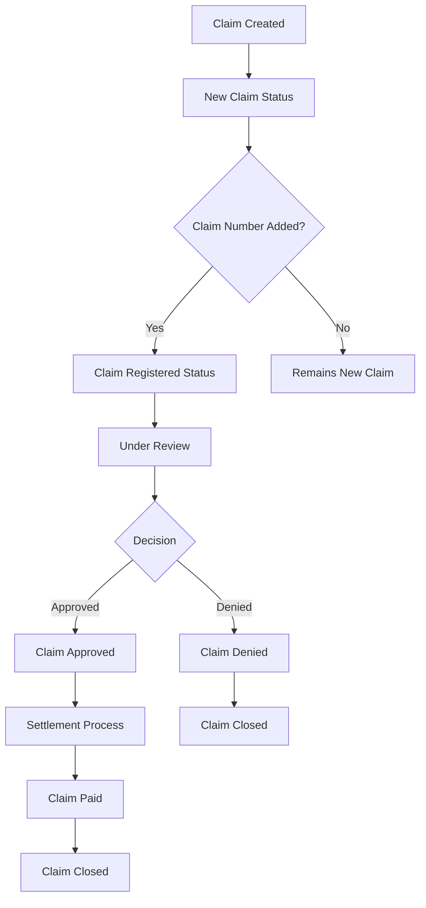

# Claims Module Documentation

## Overview

The Claims Module is a comprehensive insurance claims management system built with Laravel and Vue.js. It handles the entire lifecycle of insurance claims from creation to resolution, supporting multiple lines of business including Car/Motor, Health, Life, and Travel insurance.

## Table of Contents

1. [Architecture Overview](#architecture-overview)
2. [Core Components](#core-components)
3. [Claim Types & Statuses](#claim-types--statuses)
4. [Business Logic & Workflow](#business-logic--workflow)
5. [API Endpoints](#api-endpoints)
6. [Database Schema](#database-schema)
7. [Frontend Components](#frontend-components)
8. [Permissions & Security](#permissions--security)
9. [Integration Points](#integration-points)
10. [Development Guidelines](#development-guidelines)

## Architecture Overview

The Claims Module follows a layered architecture pattern:

```
┌─────────────────────────────────────────┐
│              Frontend Layer             │
│    (Vue.js Components with Inertia)     │
├─────────────────────────────────────────┤
│             Controller Layer            │
│         (ClaimsController)              │
├─────────────────────────────────────────┤
│              Service Layer              │
│         (ClaimsService)                 │
├─────────────────────────────────────────┤
│               Model Layer               │
│  (ClaimRequest, ClaimRequestDetail)     │
├─────────────────────────────────────────┤
│             Database Layer              │
│    (MySQL with Auditing & Soft Deletes) │
└─────────────────────────────────────────┘
```

## Core Components

### 1. Models

#### `ClaimRequest` Model

- **Location**: `app/Models/ClaimRequest.php`
- **Purpose**: New FRD-compliant claim request model
- **Key Features**:
  - Strict typing with `declare(strict_types=1)`
  - Comprehensive relationship management
  - Business-specific scopes
  - Auto-UUID generation

#### `ClaimRequestDetail` Model

- **Location**: `app/Models/ClaimRequestDetail.php`
- **Purpose**: Detailed information for claim requests
- **Key Features**:
  - Car-specific details (make, model, year, plate number)
  - Health-specific details (service types, reference numbers)
  - IP tracking for audit purposes

### 2. Controllers

#### `ClaimsController`

- **Location**: `app/Http/Controllers/ClaimsController.php`
- **Purpose**: Main controller handling claim operations
- **Key Methods**:
  - `index()` - List claims with filtering
  - `create()` - Show claim creation form
  - `store()` - Create new claim
  - `show()` - Display claim details
  - `edit()` - Show claim edit form
  - `update()` - Update existing claim
  - `updateClaimDetails()` - Update specific claim details
  - `updateClaimStatuses()` - Update claim status
  - `updateComplaintStatus()` - Update complaint status
  - `updateNextFollowUp()` - Update next follow-up
  - `searchPolicies()` - Search active policies
  - `getClaimLeadHistory()` - Get claim status history
  - `getClaimSubStatusLogs()` - Get sub-status change logs

### 3. Services

#### `ClaimsService`

- **Location**: `app/Services/ClaimsService.php`
- **Purpose**: Business logic layer for claim operations
- **Key Features**:
  - Extends `BaseService` with `CentralTrait`
  - Dynamic fillable field handling using model-based arrays
  - Comprehensive filtering and pagination
  - Policy search functionality
  - Status management logic
  - Dropdown data management
  - Document management with ZIP creation
  - Audit trail and logging functionality
  - Complaint and follow-up management

### 4. Request Validation

#### Form Request Classes

- **`ClaimStoreRequest`**: Validation for creating new claim requests
- **`ClaimDetailsUpdateRequest`**: Validation for updating specific claim details
- **`ClaimStatusUpdateRequest`**: Validation for status updates
- **`SearchPoliciesRequest`**: Validation for policy searches

**Key Validation Features**:

- Line of Business (LOB) specific validation
- Comprehensive regex patterns for names, emails, phone numbers
- Data normalization in `prepareForValidation()`
- Custom validation logic in `withValidator()`
- Structured error logging

### 5. Observers

#### `ClaimRequestObserver`

- **Location**: `app/Observers/ClaimRequestObserver.php`
- **Purpose**: Handle business logic on model events
- **Key Features**:
  - Automatic status updates when claim number is added
  - Claim closure logic based on sub-status changes
  - Comprehensive logging of state changes

## Claim Types & Statuses

### Claim Types

#### Motor/Car Claims

- **Own Damage Claim** (`own-damage-claim`)
- **Recoverable Claim** (`recoverable-claim`)
- **Unknown Damage Claim** (`unknown-damage-claim`)
- **Water Damage** (`water-damage`)
- **Theft** (`theft`)
- **Fire/Arson** (`fire-arson`)
- **Windscreen Only** (`windscreen-only`)

#### Health Claims

- **Reimbursement** (`reimbursement`)
- **Pending Approvals** (`pending-approvals`)
- **Ask a Question** (`ask-a-question`)

#### Service Types (Health)

- **In-Patient Request** (`in-patient-request`)
- **Out-Patient Request** (`out-patient-request`)

### Claim Statuses

#### Main Statuses

- **Open** - Active claims requiring attention
- **Closed** - Resolved claims

#### Sub-Statuses Workflow

##### General Workflow

1. **New Claim** - Initial status when claim is created
2. **Claim Initiated** - Claim processing has begun
3. **Claim Registered** - Claim officially registered in system
4. **Claim Under Review** - Being evaluated by claims team
5. **Claim Approved/Denied** - Decision made
6. **Claim Paid** - Settlement completed

##### Motor-Specific Workflow

1. **Claim Registered and Awaiting Inspection**
2. **Estimate Under Review**
3. **Survey in Progress**
4. **Repair Completed and Claim Settled**
5. **Total Loss Paid and Claim Settled**
6. **Cash Loss Paid and Claim Settled**

##### Health-Specific Workflow

- **Pending Approvals**: New Request → Under Evaluation → Request Approved/Denied
- **Ask a Question**: Under Review → Answered & Closed

## Business Logic & Workflow

### Claim Lifecycle



### Automatic Status Updates

The system automatically updates claim statuses based on:

1. **Claim Number Addition**: When a claim number is added, status changes to "Claim Registered"
2. **Sub-Status Changes**: Main status automatically updates based on sub-status
3. **Settlement Completion**: Status changes to "Closed" when settlement is complete

### Business Rules

#### Status Transition Rules

- Claims automatically close when reaching terminal sub-statuses
- Complaint status affects main claim status
- Manager assignment triggers date tracking
- Follow-up dates enable overdue tracking

#### LOB-Specific Rules

- **Car Claims**: Require vehicle details (make, model, year, plate number)
- **Health Claims**: Require service type for pending approvals
- **All Claims**: Require incident date and claim type

#### Dynamic Field Management

- **Model-Based Fillable**: Uses `getFillable()` from models for dynamic field handling
- **Form-Specific Fields**: Additional fields like `incident_story`, `whatsapp_consent` added programmatically
- **Filtered Updates**: Specific methods use `array_intersect()` to limit fields for targeted updates
- **Automatic Sync**: Field definitions automatically stay in sync with model changes

## API Endpoints

### Web Routes

| Method | Endpoint                                 | Name                       | Purpose             |
| ------ | ---------------------------------------- | -------------------------- | ------------------- |
| GET    | `/claims`                                | `claims.index`             | List claims         |
| GET    | `/claim/create`                          | `claims.create`            | Show create form    |
| POST   | `/claim`                                 | `claims.store`             | Create claim        |
| GET    | `/claim/{uuid}`                          | `claims.show`              | Show claim details  |
| GET    | `/claim/{uuid}/edit`                     | `claims.edit`              | Show edit form      |
| PUT    | `/claim/{uuid}`                          | `claims.update`            | Update claim        |
| POST   | `/claim/search-policies`                 | `claims.search-policies`   | Search policies     |
| POST   | `/claim/update-details/{uuid}`           | `claims.update.details`    | Update details      |
| POST   | `/claim/update-statuses/{uuid}`          | `claims.update.status`     | Update status       |
| POST   | `/claims/{claim:uuid}/send-notification` | `claims.send-notification` | Send notification   |
| POST   | `/claims/{claim:uuid}/complaint-status`  | `claims.complaint-status`  | Update complaint    |
| POST   | `/claims/{claim:uuid}/next-follow-up`    | `claims.next-follow-up`    | Update follow-up    |
| GET    | `/claims/{claim:uuid}/lead-history`      | `claims.lead-history`      | Get status history  |
| GET    | `/claims/{claim:uuid}/sub-status-logs`   | `claims.sub-status-logs`   | Get sub-status logs |

### API Response Format

```json
{
  "success": true,
  "data": {
    // Response data
  },
  "message": "Operation completed successfully"
}
```

### Error Response Format

```json
{
  "success": false,
  "message": "Error description",
  "errors": {
    "field_name": ["Validation error message"]
  }
}
```

## Database Schema

### Primary Tables

#### `claim_requests` Table

- Primary key: `id`
- UUID: `uuid` for routing
- Code: `code` for reference
- Foreign keys: `quote_type_id`, `claim_status_id`, `claim_sub_status_id`
- Manager tracking: `manager_id`, `manager_assigned_date`
- Financial fields: `approved_repair_amount`, `approved_total_loss_amount`

#### `claim_request_details` Table

- Primary key: `id`
- Foreign key: `claim_request_id`
- Car details: `car_make`, `car_model`, `model_year`, `plate_number`
- Health details: `service_type_id`, `request_reference_number`
- Tracking: `user_ip`

### Relationships

```
ClaimRequest (1) --> (1) ClaimRequestDetail
ClaimRequest (*) --> (1) User (manager)
ClaimRequest (*) --> (1) QuoteType
ClaimRequest (*) --> (1) ClaimStatus
ClaimRequest (*) --> (1) ClaimSubStatus
ClaimRequest (1) --> (*) Activities
ClaimRequest (1) --> (*) Documents (polymorphic)
```

## Frontend Components

### Vue.js Components

#### Main Pages

- **`Claims/Index.vue`** - Claims listing with filters
- **`Claims/Show.vue`** - Claim details view
- **`Claims/Create.vue`** - Claim creation form
- **`Claims/Edit.vue`** - Claim editing form

#### Component Structure

- **`Claims/Components/ClaimDetails.vue`** - Claim details component
- **`Claims/Components/ClaimStatus.vue`** - Status management component
- **`Claims/Components/ClaimDocuments.vue`** - Document management

#### Key Frontend Features

- **Permission-based UI**: Uses `useCan()` composable
- **Real-time Validation**: Mirrors backend validation
- **Reactive Dropdowns**: Based on LOB selection
- **Error Handling**: Comprehensive toast notifications
- **Data Transformation**: Consistent data formatting

### Component Patterns

```vue
<script setup>
// Permission checking
const can = permission => useCan(permission);

// Form handling
const form = useForm({
  // Form data
});

// Validation that mirrors backend
const validateForm = () => {
  // Custom validation logic
};

// Error handling
const notification = useToast();
</script>
```

## Permissions & Security

### Permission Constants

From `PermissionsEnum`:

- `CLAIM_LIST` - View claims list
- `CLAIM_CREATE` - Create new claims
- `CLAIM_EDIT` - Edit existing claims
- `CLAIM_SHOW` - View claim details
- `CLAIMS_EXPORT_DATA` - Export claims data

### Security Features

1. **UUID-based Routing** - Prevents ID enumeration
2. **Permission Middleware** - Controller-level access control
3. **Input Sanitization** - All inputs trimmed and normalized
4. **SQL Injection Prevention** - Eloquent ORM only
5. **CSRF Protection** - Automatic token validation
6. **Audit Logging** - Complete change tracking

### Role-based Access

- **Claims Managers** - Full access to assigned claims
- **Admins** - Full system access
- **SuperAdmins** - Complete administrative access

## Integration Points

### External Services

#### CAPI Integration

- **Endpoint**: `/api/v2-save-claim`
- **Purpose**: External claim creation
- **Data Flow**: Frontend → ClaimsService → CAPI → Database

#### Bird Service Integration

- **Purpose**: Email notifications and workflows
- **Configuration**: `ApplicationStorageEnums::BIRD_NB_MOTOR_WORKFLOW`
- **Data**: Customer details, advisor information, workflow triggers

### Internal Integrations

#### Quote System Integration

- **Policy Search**: Active policy lookup for claim creation
- **Customer Data**: Pre-populate claim forms from policy data
- **Advisor Assignment**: Automatic advisor linking

#### Document Management

- **Polymorphic Relations**: Claims can have multiple document types
- **Document Categories**: Claim-specific document categorization
- **Upload Tracking**: Complete audit trail for documents
- **ZIP Creation**: Bulk document download functionality
- **Document Validation**: File existence and structure validation
- **Azure Storage Integration**: Documents stored on Azure blob storage

## Development Guidelines

### Code Standards

#### PHP Standards

- Use `declare(strict_types=1)` in all files
- Follow PSR-12 coding standards
- Implement comprehensive error handling
- Use typed properties and return types

#### Laravel Patterns

- Extend `BaseService` for service classes
- Use `CentralTrait` for common functionality
- Implement `FormRequest` for validation
- Use observers for business logic triggers
- Leverage model `getFillable()` for dynamic field handling
- Use `array_intersect()` for filtered field updates
- Implement proper exception handling with structured logging
- Use `RolesEnum` for role-based access control

#### Vue.js Patterns

- Use Composition API with `<script setup>`
- Implement permission checks with `useCan()`
- Mirror backend validation in frontend
- Use consistent error handling patterns

### Testing Strategy

#### Feature Tests

- Test all controller endpoints
- Verify permission-based access
- Test complete user workflows
- Mock external dependencies

#### Unit Tests

- Test service layer methods
- Test model relationships and scopes
- Test validation logic
- Test business rule implementations

### Performance Considerations

1. **Query Optimization**

   - Use eager loading with specific field selection
   - Implement proper database indexing
   - Use `simplePaginate()` for large datasets

2. **Caching Strategy**

   - Cache dropdown data
   - Cache frequently accessed lookups
   - Implement query result caching

3. **Frontend Optimization**
   - Lazy load components
   - Implement virtual scrolling for large lists
   - Use computed properties for reactive data

### Maintenance & Updates

#### Update Protocol

1. Review current patterns before making changes
2. Update documentation with new features
3. Update cursor rules (`.cursor/rules/claim-module-architecture.mdc`) with new patterns
4. Validate security implementations
5. Test pattern consistency across modules
6. Update frontend patterns to align with backend
7. Verify permission systems after changes
8. Ensure proper logging implementation
9. Review performance impact
10. Update inline documentation

#### Monitoring & Logging

- All actions logged with `LoggerService`
- Structured logging with context data
- User ID tracking in all operations
- Error logging with stack traces
- Performance monitoring for slow queries

---

## Quick Reference

### Key Files

- **Controller**: `app/Http/Controllers/ClaimsController.php`
- **Service**: `app/Services/ClaimsService.php`
- **Models**: `app/Models/ClaimRequest.php`, `app/Models/ClaimRequestDetail.php`
- **Observer**: `app/Observers/ClaimRequestObserver.php`
- **Enums**: `app/Enums/ClaimsEnum.php`
- **Frontend**: `resources/js/inertia/Pages/Claims/`

### Common Commands

```bash
# Run claim-related tests
php artisan test --filter=Claims

# Seed claim statuses
php artisan db:seed --class=ClaimStatusesSeeder

# Clear claim-related cache
php artisan cache:forget claims.*
```

### Support Contacts

- **Development Team**: [Your team contact]
- **Business Analyst**: [BA contact]
- **System Administrator**: [Admin contact]

---

_Last Updated: [Current Date]_
_Version: 1.0_
