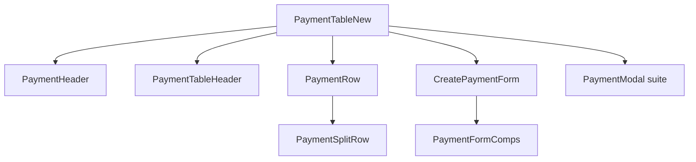

# Manage Payments UI — component map

This guide describes the **Manage Payments** block used on quote show pages (`PaymentTableNew.vue`) and every nested piece that touches payment creation, splits, links, and modals. Paths are under `resources/js/inertia/Components/` unless noted.

**See also:** [Payment endpoints index (`web.php` ~440–454)](./PaymentEndpointsWeb440-454.md) · [Payment store/update HTTP routes & observers](./PaymentStoreUpdateRoutes.md) · [Split approve/decline](./PaymentSplitApproveDeclineRoute.md).

---

## Directory layout (on disk)

```
resources/js/inertia/
├── Components/
│   ├── PaymentTableNew.vue                 ← root shell + orchestration
│   ├── UpdateTotalPrice.vue                ← sibling: total/plan edit (used by header)
│   └── PaymentComponents/
│       ├── index.js                        ← barrel: table shell + CreatePaymentForm
│       ├── PaymentHeader.vue
│       ├── PaymentTableHeader.vue
│       ├── PaymentRow.vue
│       ├── PaymentSplitRow.vue
│       ├── CreatePaymentForm.vue
│       ├── PaymentFormComps/
│       │   ├── index.js
│       │   ├── PaymentFields.vue
│       │   ├── PaymentAlerts.vue
│       │   ├── PaymentScheduleTable.vue
│       │   ├── PaymentNotes.vue
│       │   ├── PaymentVerified.vue
│       │   ├── PaymentDecline.vue
│       │   ├── PaymentVerification.vue
│       │   └── PaymentFooter.vue
│       └── PaymentModal/
│           ├── index.js
│           ├── AmlApprovalModal.vue
│           ├── ImageGalleryModal.vue
│           ├── RetryPaymentModal.vue
│           ├── DeleteSplitPaymentModal.vue
│           ├── DeleteParentPaymentModal.vue
│           ├── VoidPaymentModal.vue
│           └── TabbyPaymentNotificationModal.vue
└── Composables/
    ├── usePayment.js
    ├── useAMLKYC.js
    └── useDocumentTempUrl.js
```

---

## Quick reference table (group → responsibility)

| Group                 | Folder / entry file                                          | What lives here                                                                        |
| --------------------- | ------------------------------------------------------------ | -------------------------------------------------------------------------------------- |
| **Shell**             | `PaymentTableNew.vue`                                        | Collapsible card, totals, all modal wiring, handlers for add/edit/CC link/delete/void. |
| **Table chrome**      | `PaymentComponents/` (`PaymentHeader`, `PaymentTableHeader`) | Header actions + column titles.                                                        |
| **Grid rows**         | `PaymentComponents/` (`PaymentRow`, `PaymentSplitRow`)       | Parent payment row + expanded split rows (links, capture, retry).                      |
| **Create/edit UI**    | `PaymentComponents/CreatePaymentForm.vue`                    | Modal form orchestration; calls into `PaymentFormComps` + Tabby modal.                 |
| **Form sections**     | `PaymentComponents/PaymentFormComps/`                        | Fields, schedule, alerts, notes, verify/decline/verification, footer.                  |
| **Dialogs**           | `PaymentComponents/PaymentModal/`                            | AML, gallery, retry, delete split/parent, void, Tabby notice.                          |
| **Plan/total widget** | `Components/UpdateTotalPrice.vue`                            | Optional total price control from payment header.                                      |
| **Shared logic**      | `inertia/Composables/`                                       | `usePayment`, `useAMLKYC`, `useDocumentTempUrl` — formatting, AML/KYC, doc URLs.       |

---

## End-to-end flow (short)

1. **Server** sends `payments`, `quoteRequest`, plan/pricing props, and enums (`paymentStatusEnum`, `paymentMethodsEnum`, tooltips, etc.) via Inertia.
2. **PaymentTableNew** renders the collapsible section, wires totals/plan context, and coordinates modals.
3. **PaymentHeader** shows summary actions (e.g. add payment, proforma) when permissions allow.
4. **PaymentRow** lists each parent payment; expanding a row shows **PaymentSplitRow** for each split (CC/Tabby/IPL, capture, links).
5. **CreatePaymentForm** opens inside a large modal for create/edit/view/capture; it composes **PaymentFormComps** for fields, schedule, alerts, and footer actions.
6. Dedicated **PaymentModal** components handle AML approval, retries, deletes, void, and document gallery.



---

## Root: `PaymentTableNew.vue`

**Role:** Single orchestrator for the Manage Payments card. Holds shared refs (modals, capture validation, delete/void targets), computes `totalPrice` / `initialAmount` from quote type (Health, Life, Savings, send-update, plan-detail, etc.), and implements handlers: `addPaymentModal`, `editPaymentModal`, `generateCCLink`, insurer receipt check, AML fetch, and events bubbled from rows. Passes enums and `bookPolicyDetails` into children for CC/Tabby flags and permissions.

---

## Direct table shell

### `PaymentComponents/PaymentHeader.vue`

**Role:** Top bar for the payment table: total/proforma context, read-only vs action mode from permissions, and primary actions such as **Add payment** (emits `add-payment-modal`). May include plan/total widgets (e.g. `UpdateTotalPrice`) and download/copy flows for proforma where applicable.

### `PaymentComponents/PaymentTableHeader.vue`

**Role:** Static column headers for the payment grid (amounts, status, methods, actions). Keeps table semantics separate from row data.

### `PaymentComponents/PaymentRow.vue`

**Role:** One row per **parent payment**: status, collection type, frequency, expand/collapse, and action buttons (edit, delete, void, AML) gated by `useAMLKYC` / `usePayment` and quote rules. Emits events upward so `PaymentTableNew` opens the create/edit modal or shows capture alerts.

### `PaymentComponents/PaymentSplitRow.vue`

**Role:** One row per **split** under an expanded parent: per-split amount, method (CC/Tabby/IPL/etc.), status, capture/retry/delete, **generate payment link** (emits `generate-cc-link`), and view/edit split. Uses `usePayment` for formatting and Tabby/tooltip rules; posts to prepayment/API routes where needed.

---

## Create / edit modal: `PaymentComponents/CreatePaymentForm.vue`

**Role:** Large modal body for **New payment**, **Update payment**, **View**, **Capture**, and **Approve** flows. Owns most form state: splits, due dates, discounts, credit approval, documents, frequency, collection type, and validation. Embeds **PaymentFormComps** and **TabbyPaymentNotificationModal** when Tabby rules apply. Exposes imperative methods (e.g. reset/initialize) that `PaymentTableNew` calls via `ref`.

---

## Nested form pieces: `PaymentComponents/PaymentFormComps/`

### `PaymentFields.vue` (exported as `PaymentFormFields`)

**Role:** Main inputs: collection type, provider, amounts, payment method per split, dates, references, and method-specific UI (cards, cheques, IPL, etc.).

### `PaymentAlerts.vue` (exported as `PaymentFormAlerts`)

**Role:** Inline warnings/errors (e.g. validation, provider rules, lacking payment) driven by props and local flags from the parent form.

### `PaymentScheduleTable.vue` (exported as `PaymentFormScheduleTable`)

**Role:** Renders instalment / split schedule when frequency is not single up-front (Life/Savings/multi-pay).

### `PaymentNotes.vue` (exported as `PaymentFormNotes`)

**Role:** Notes fields tied to payment or approval workflows.

### `PaymentVerified.vue` (exported as `PaymentFormVerified`)

**Role:** UI for verified/approved payment states and related messaging.

### `PaymentDecline.vue` (exported as `PaymentFormDecline`)

**Role:** Decline flow: reasons and confirmation for rejecting a payment/split where applicable.

### `PaymentVerification.vue` (exported as `PaymentFormVerification`)

**Role:** Extra verification steps (e.g. checks or compliance) before submit.

### `PaymentFooter.vue` (exported as `PaymentFormFooter`)

**Role:** Modal footer actions: submit, cancel, capture, approve—wired to parent form state and permissions.

---

## Modals: `PaymentComponents/PaymentModal/`

### `AmlApprovalModal.vue`

**Role:** Clears or completes AML screening from the payment context; posts with quote type/id and closes on success.

### `ImageGalleryModal.vue`

**Role:** Full-screen/lightbox view of uploaded payment proof images inside the create-payment modal stack.

### `RetryPaymentModal.vue`

**Role:** Retry a failed background payment process using `payment_process_job_id` and quote identifiers.

### `DeleteSplitPaymentModal.vue`

**Role:** Confirms deletion of a **child split**; calls delete API with split id, status, and payment code.

### `DeleteParentPaymentModal.vue`

**Role:** Confirms deletion of the **whole parent payment** record.

### `VoidPaymentModal.vue`

**Role:** Void workflow for an authorised/captured payment with quote/send-update context.

### `TabbyPaymentNotificationModal.vue`

**Role:** Tabby-specific notice (limits, eligibility) before or during Tabby selection; used from `CreatePaymentForm`.

---

## Related sibling (used by header)

### `Components/UpdateTotalPrice.vue`

**Role:** Plan/total price editor surfaced from **PaymentHeader** on LOBs that allow updating total from this section (not inside `PaymentComponents/` folder but part of the same UX).

---

## Composables used by the payment table

### `inertia/Composables/usePayment.js`

**Role:** Shared payment helpers: format date/amount/string, filter CC/Tabby splits, capture-valid statuses, Tabby disable rules/tooltips, and allocation tooltips. Keeps **PaymentRow**, **PaymentSplitRow**, and **CreatePaymentForm** aligned on method codes and status IDs from page props.

### `inertia/Composables/useAMLKYC.js`

**Role:** `isAmlVerified`, `isKycVerified`, and related checks (with Travel/Cyber/GIG/CC bypass rules) so rows and buttons respect AML/KYC before capture or sensitive actions.

### `inertia/Composables/useDocumentTempUrl.js` (used in CreatePaymentForm)

**Role:** Temporary URLs for viewing uploaded documents in the form/gallery flow.

---

## Barrel exports

- `PaymentComponents/index.js` — `PaymentHeader`, `PaymentTableHeader`, `PaymentRow`, `PaymentSplitRow`, `CreatePaymentForm`.
- `PaymentComponents/PaymentFormComps/index.js` — all `PaymentForm*` pieces above.
- `PaymentComponents/PaymentModal/index.js` — all modal components listed in the Modals section.

---

## Tips for new contributors

- **Enums** (`paymentStatusEnum`, `paymentMethodsEnum`, `paymentTooltipEnum`, …) come from `HandleInertiaRequests` (or page-specific props); prefer them over hard-coded IDs/strings in new UI.
- **Parent vs split**: parent = `payments[]` item; splits = `payment.payment_splits[]`. List actions on splits usually emit from **PaymentSplitRow**; parent-level actions from **PaymentRow**.
- **Adding a button** on the grid: decide row vs split vs header, then thread props/events through **PaymentTableNew** if new server calls or modal state are needed.
